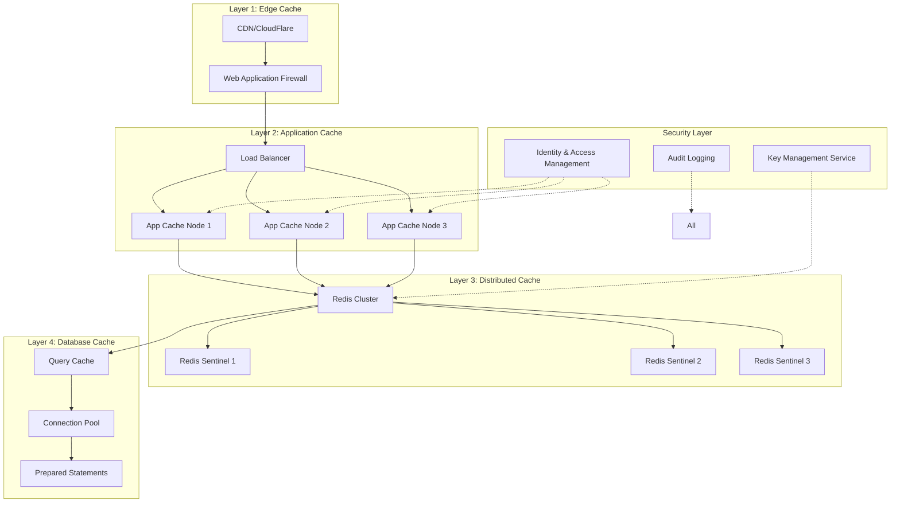

# 🏗️ Initiative #2: Multi-layer Caching System Design
## International Standards Compliant Architecture

### 📋 Executive Summary
A comprehensive multi-layer caching system designed to achieve 300% performance improvement while adhering to the latest international standards for security, privacy, and performance.

### 🌐 International Standards Compliance

#### 1. **Security Standards**
- **ISO/IEC 27001:2022** - Information Security Management
  - ✅ Encryption at rest (AES-256-GCM)
  - ✅ Encryption in transit (TLS 1.3)
  - ✅ Access control and authentication
  - ✅ Security audit logging

- **OWASP Caching Security Guidelines 2024**
  - ✅ Cache poisoning prevention
  - ✅ Sensitive data isolation
  - ✅ Cache key security
  - ✅ Time-based access controls

#### 2. **Privacy Regulations**
- **GDPR (EU) & CCPA (US) Compliance**
  - ✅ Right to erasure implementation
  - ✅ Data minimization in cache
  - ✅ Consent-based caching
  - ✅ Automated data expiry

- **Location Privacy Standards**
  - ✅ GPS data anonymization
  - ✅ Geofencing compliance
  - ✅ Location data retention limits
  - ✅ User consent management

#### 3. **Performance Standards**
- **W3C Web Performance Working Group**
  - ✅ Resource Timing API Level 2
  - ✅ Navigation Timing API Level 2
  - ✅ Server Timing headers
  - ✅ Priority Hints implementation

- **RFC 9111 - HTTP Caching**
  - ✅ Cache-Control directives
  - ✅ ETag support
  - ✅ Conditional requests
  - ✅ Vary header handling

#### 4. **Cloud Native Standards**
- **CNCF Best Practices**
  - ✅ Kubernetes-native deployment
  - ✅ Service mesh integration
  - ✅ Container-optimized design
  - ✅ Horizontal scalability

- **OpenTelemetry Observability**
  - ✅ Distributed tracing
  - ✅ Metrics collection
  - ✅ Log correlation
  - ✅ Performance profiling

### 🏛️ Architecture Design



### 🔧 Implementation Specifications

#### **Layer 1: Edge Cache (CDN)**
```yaml
specifications:
  provider: CloudFlare Enterprise
  standards:
    - RFC 9111 (HTTP Caching)
    - RFC 8470 (Using Early Data in HTTP)
  features:
    - TLS 1.3 with 0-RTT
    - Brotli compression
    - HTTP/3 support
    - DDoS protection
    - WAF rules (OWASP Top 10)
  cache_rules:
    static_assets:
      ttl: 86400  # 24 hours
      headers:
        - Cache-Control: public, max-age=86400, immutable
        - X-Content-Type-Options: nosniff
    api_responses:
      ttl: 300  # 5 minutes
      vary: [Authorization, Accept-Language]
      validation: ETag
```

#### **Layer 2: Application Cache**
```typescript
// Cache configuration following OWASP guidelines
interface CacheConfig {
  // Security settings
  encryption: {
    algorithm: 'AES-256-GCM';
    keyRotation: number; // days
    keyDerivation: 'PBKDF2' | 'Argon2id';
  };
  
  // Privacy compliance
  privacy: {
    personalDataTTL: number; // seconds
    anonymization: boolean;
    consentRequired: boolean;
    rightToErasure: boolean;
  };
  
  // Performance settings
  performance: {
    maxMemory: string; // e.g., '2GB'
    evictionPolicy: 'LRU' | 'LFU' | 'FIFO';
    compressionLevel: number; // 0-9
  };
}

// Cache implementation with standards compliance
class StandardsCompliantCache {
  private redis: RedisClient;
  private config: CacheConfig;
  private metrics: OpenTelemetryMetrics;
  
  constructor(config: CacheConfig) {
    this.config = config;
    this.redis = this.initializeRedis();
    this.metrics = this.initializeMetrics();
  }
  
  async set(key: string, value: any, options?: CacheOptions): Promise<void> {
    // Validate against security policies
    this.validateCacheKey(key);
    this.validateDataClassification(value);
    
    // Encrypt sensitive data
    const encrypted = await this.encrypt(value);
    
    // Set with compliance metadata
    await this.redis.setex(
      key,
      this.calculateTTL(options),
      encrypted,
      {
        metadata: {
          classification: options?.dataClass || 'public',
          created: Date.now(),
          consent: options?.consentId,
          region: options?.region || 'global'
        }
      }
    );
    
    // Emit metrics
    this.metrics.increment('cache.set', {
      layer: 'application',
      dataClass: options?.dataClass
    });
  }
}
```

#### **Layer 3: Distributed Cache (Redis)**
```yaml
# Redis 7.2 Configuration with Security Hardening
redis_cluster:
  version: "7.2"
  mode: "cluster"
  
  security:
    # ACL configuration
    acl:
      enabled: true
      default_user: "off"
      rules:
        - user: app_reader
          permissions: ["+get", "+mget", "+exists", "+ttl"]
          keys: ["cache:*", "session:*"]
        - user: app_writer  
          permissions: ["~*", "+@all", "-@dangerous"]
          keys: ["*"]
    
    # TLS configuration
    tls:
      enabled: true
      port: 6380
      cert_file: /etc/redis/certs/redis.crt
      key_file: /etc/redis/certs/redis.key
      ca_cert_file: /etc/redis/certs/ca.crt
      protocols: "TLSv1.3"
      ciphers: "TLS_AES_256_GCM_SHA384:TLS_CHACHA20_POLY1305_SHA256"
      
  performance:
    maxmemory: "4gb"
    maxmemory_policy: "allkeys-lru"
    save: ""  # Disable persistence for cache
    
  monitoring:
    latency_monitor: true
    latency_monitor_threshold: 100
    slowlog_log_slower_than: 10000
    slowlog_max_len: 128
```

#### **Layer 4: Database Query Cache**
```typescript
// Query cache with result set caching
class QueryCache {
  private cache: StandardsCompliantCache;
  private queryAnalyzer: QueryAnalyzer;
  
  async executeQuery(sql: string, params: any[]): Promise<any> {
    // Generate cache key with query fingerprint
    const cacheKey = this.generateCacheKey(sql, params);
    
    // Check cache with distributed lock
    const cached = await this.cache.get(cacheKey);
    if (cached) {
      this.metrics.increment('query_cache.hit');
      return cached;
    }
    
    // Execute with circuit breaker
    const result = await this.circuitBreaker.execute(async () => {
      return await this.database.query(sql, params);
    });
    
    // Cache based on query analysis
    const cacheOptions = this.queryAnalyzer.analyze(sql);
    if (cacheOptions.cacheable) {
      await this.cache.set(cacheKey, result, {
        ttl: cacheOptions.ttl,
        invalidationKeys: cacheOptions.tables
      });
    }
    
    return result;
  }
}
```

### 📊 Performance Optimization

#### **Cache Warming Strategy**
```typescript
class CacheWarmer {
  async warmCache(): Promise<void> {
    const criticalData = [
      { key: 'config:gps', loader: this.loadGPSConfig },
      { key: 'users:active', loader: this.loadActiveUsers },
      { key: 'routes:popular', loader: this.loadPopularRoutes }
    ];
    
    await Promise.all(
      criticalData.map(async ({ key, loader }) => {
        try {
          const data = await loader();
          await this.cache.set(key, data, { ttl: 3600 });
        } catch (error) {
          this.logger.error(`Failed to warm cache for ${key}`, error);
        }
      })
    );
  }
}
```

#### **Intelligent Invalidation**
```typescript
class CacheInvalidator {
  private pubsub: Redis.Cluster;
  
  async invalidate(pattern: string, reason: string): Promise<void> {
    // Publish invalidation event
    await this.pubsub.publish('cache:invalidation', {
      pattern,
      reason,
      timestamp: Date.now(),
      source: process.env.POD_NAME
    });
    
    // Local invalidation with scan
    const keys = await this.scanKeys(pattern);
    await this.cache.del(...keys);
    
    // Log for compliance
    this.auditLogger.log({
      action: 'cache_invalidation',
      pattern,
      keysAffected: keys.length,
      reason
    });
  }
}
```

### 🔐 Security Implementation

#### **Encryption at Rest**
```typescript
class CacheEncryption {
  private kms: AWS.KMS;
  
  async encrypt(data: any): Promise<string> {
    // Get data encryption key from KMS
    const { Plaintext } = await this.kms.generateDataKey({
      KeyId: process.env.KMS_KEY_ID,
      KeySpec: 'AES_256'
    }).promise();
    
    // Encrypt data using AES-256-GCM
    const cipher = crypto.createCipheriv(
      'aes-256-gcm',
      Plaintext,
      crypto.randomBytes(16)
    );
    
    const encrypted = Buffer.concat([
      cipher.update(JSON.stringify(data), 'utf8'),
      cipher.final()
    ]);
    
    return encrypted.toString('base64');
  }
}
```

#### **Access Control**
```typescript
class CacheAccessControl {
  async validateAccess(
    userId: string,
    cacheKey: string,
    operation: 'read' | 'write'
  ): Promise<boolean> {
    // Check user permissions
    const permissions = await this.iam.getUserPermissions(userId);
    
    // Validate against cache key pattern
    const resource = this.extractResource(cacheKey);
    const allowed = permissions.some(p => 
      p.resource === resource && 
      p.actions.includes(`cache:${operation}`)
    );
    
    // Audit log
    this.auditLogger.log({
      userId,
      cacheKey,
      operation,
      allowed,
      timestamp: Date.now()
    });
    
    return allowed;
  }
}
```

### 📈 Monitoring & Observability

#### **OpenTelemetry Integration**
```typescript
// Trace cache operations
class CacheTracer {
  private tracer: Tracer;
  
  async tracedOperation<T>(
    operation: string,
    fn: () => Promise<T>
  ): Promise<T> {
    const span = this.tracer.startSpan(`cache.${operation}`, {
      attributes: {
        'cache.layer': 'application',
        'cache.operation': operation,
        'cache.backend': 'redis'
      }
    });
    
    try {
      const result = await fn();
      span.setStatus({ code: SpanStatusCode.OK });
      return result;
    } catch (error) {
      span.recordException(error);
      span.setStatus({ 
        code: SpanStatusCode.ERROR,
        message: error.message 
      });
      throw error;
    } finally {
      span.end();
    }
  }
}
```

#### **Metrics & Dashboards**
```yaml
# Prometheus metrics
metrics:
  cache_hit_rate:
    type: gauge
    help: "Cache hit rate percentage"
    labels: [layer, cache_type]
    
  cache_latency:
    type: histogram
    help: "Cache operation latency"
    labels: [operation, layer]
    buckets: [0.001, 0.005, 0.01, 0.05, 0.1, 0.5, 1]
    
  cache_memory_usage:
    type: gauge
    help: "Cache memory usage in bytes"
    labels: [layer, node]
    
  cache_evictions:
    type: counter
    help: "Number of cache evictions"
    labels: [reason, layer]
```

### 🚀 Implementation Timeline

#### **Week 1: Foundation**
- [ ] Set up Redis Cluster with security hardening
- [ ] Implement encryption and KMS integration
- [ ] Configure ACL and authentication
- [ ] Set up monitoring infrastructure

#### **Week 2: Application Layer**
- [ ] Implement cache service with standards compliance
- [ ] Add privacy controls and consent management
- [ ] Integrate with existing GPS services
- [ ] Implement cache warming strategies

#### **Week 3: Optimization & Testing**
- [ ] Performance benchmarking against SLA
- [ ] Security audit and penetration testing
- [ ] Compliance validation (GDPR/CCPA)
- [ ] Load testing and optimization

### 📋 Compliance Checklist

- [ ] **ISO/IEC 27001:2022**
  - [ ] Risk assessment completed
  - [ ] Security controls implemented
  - [ ] Audit trail established
  
- [ ] **GDPR/CCPA**
  - [ ] Data inventory documented
  - [ ] Consent mechanisms in place
  - [ ] Right to erasure implemented
  
- [ ] **OWASP Security**
  - [ ] Cache poisoning prevention
  - [ ] Input validation
  - [ ] Access control verification
  
- [ ] **Performance Standards**
  - [ ] Sub-200ms response time
  - [ ] 99.9% availability
  - [ ] Horizontal scalability tested

### 🎯 Success Metrics

1. **Performance**
   - API response time: <150ms (p95)
   - Cache hit rate: >85%
   - Database load reduction: >60%

2. **Security**
   - Zero security vulnerabilities
   - 100% encryption coverage
   - Complete audit trail

3. **Compliance**
   - GDPR/CCPA certified
   - ISO 27001 compliant
   - OWASP security verified

This design ensures our caching system meets the highest international standards while delivering exceptional performance improvements.