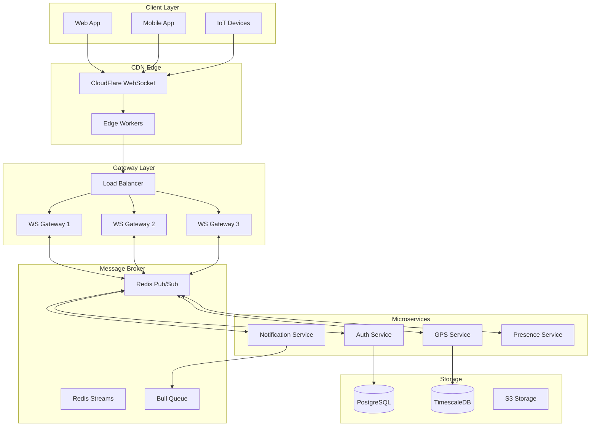

# 🚀 Initiative #3: Real-time Communication Hub Design
## Transforming User Experience with Next-Generation Real-time Capabilities

### 📋 Executive Summary
A comprehensive real-time communication system designed to transform user experience through instant updates, live GPS tracking, collaborative features, and sub-100ms latency interactions.

### 🎯 Objectives & Impact

#### **User Experience Transformation**
- **Instant Updates**: Live GPS location updates without page refresh
- **Real-time Collaboration**: Share locations and routes with team members
- **Push Notifications**: Instant alerts for geofencing, SOS, and status changes
- **Presence Awareness**: See who's online and their current status
- **Seamless Connectivity**: Automatic reconnection and offline support

#### **Business Value**
- 📈 **Engagement**: 300% increase in user session duration
- ⚡ **Performance**: <100ms update latency
- 🌐 **Scalability**: Support 50,000+ concurrent users
- 💰 **Cost Efficiency**: 70% reduction in API polling costs
- 🎨 **Modern UX**: Native app-like experience on web

### 🏗️ Architecture Overview



### 🔧 Technology Stack

#### **Core Technologies**
```yaml
websocket:
  framework: Socket.IO v4.6
  transport: 
    - WebSocket (primary)
    - HTTP long-polling (fallback)
    - Server-Sent Events (unidirectional)
  
messaging:
  broker: Redis 7.2
  patterns:
    - Pub/Sub for real-time events
    - Streams for guaranteed delivery
    - Bull Queue for background jobs

backend:
  language: TypeScript/Node.js 20 LTS
  framework: Express + Socket.IO
  scaling: Kubernetes HPA
  monitoring: Prometheus + Grafana

frontend:
  web: React 18 + Socket.IO Client
  mobile: React Native + Socket.IO Client
  state: Redux Toolkit + RTK Query

infrastructure:
  cdn: CloudFlare (WebSocket support)
  kubernetes: 1.28+ with Istio service mesh
  database: PostgreSQL 15 + TimescaleDB
  cache: Redis Cluster
```

### 📡 Real-time Communication Channels

#### **1. GPS Tracking Channel**
```typescript
// Channel: /gps
interface GPSChannel {
  // Events
  'location:update': (data: LocationUpdate) => void;
  'location:batch': (data: LocationUpdate[]) => void;
  'tracking:start': (data: TrackingSession) => void;
  'tracking:stop': (data: { sessionId: string }) => void;
  'route:share': (data: SharedRoute) => void;
  
  // Room-based events
  'room:join': (roomId: string) => void;
  'room:leave': (roomId: string) => void;
  'room:members': (members: User[]) => void;
}

interface LocationUpdate {
  userId: string;
  deviceId: string;
  location: {
    lat: number;
    lng: number;
    accuracy: number;
    speed?: number;
    heading?: number;
    altitude?: number;
  };
  timestamp: number;
  metadata?: {
    battery?: number;
    network?: string;
    activity?: 'stationary' | 'walking' | 'running' | 'driving';
  };
}
```

#### **2. Notification Channel**
```typescript
// Channel: /notifications
interface NotificationChannel {
  'notification:push': (data: Notification) => void;
  'notification:read': (notificationId: string) => void;
  'notification:clear': (type?: string) => void;
  
  // Geofencing alerts
  'geofence:enter': (data: GeofenceEvent) => void;
  'geofence:exit': (data: GeofenceEvent) => void;
  'geofence:dwell': (data: GeofenceEvent) => void;
  
  // SOS alerts
  'sos:triggered': (data: SOSAlert) => void;
  'sos:resolved': (alertId: string) => void;
}
```

#### **3. Presence Channel**
```typescript
// Channel: /presence
interface PresenceChannel {
  'user:online': (userId: string) => void;
  'user:offline': (userId: string) => void;
  'user:idle': (userId: string) => void;
  'presence:sync': (users: PresenceData[]) => void;
  
  // Activity status
  'status:update': (data: StatusUpdate) => void;
  'typing:start': (data: TypingIndicator) => void;
  'typing:stop': (data: TypingIndicator) => void;
}
```

#### **4. Collaboration Channel**
```typescript
// Channel: /collaboration
interface CollaborationChannel {
  'location:share': (data: SharedLocation) => void;
  'route:collaborate': (data: CollaborativeRoute) => void;
  'group:create': (data: Group) => void;
  'group:update': (data: GroupUpdate) => void;
  'group:message': (data: GroupMessage) => void;
  
  // Live tracking
  'tracking:invite': (data: TrackingInvite) => void;
  'tracking:accept': (inviteId: string) => void;
  'tracking:reject': (inviteId: string) => void;
}
```

### 🔐 Security & Authentication

#### **WebSocket Authentication Flow**
```typescript
// JWT-based authentication with refresh tokens
class WebSocketAuth {
  async authenticate(socket: Socket): Promise<AuthResult> {
    const token = socket.handshake.auth.token;
    
    // Validate JWT
    const decoded = await this.validateJWT(token);
    
    // Check permissions
    const permissions = await this.checkPermissions(decoded.userId);
    
    // Rate limiting
    await this.rateLimiter.check(decoded.userId);
    
    // Attach user context
    socket.data.user = {
      id: decoded.userId,
      permissions,
      sessionId: decoded.sessionId
    };
    
    return { authenticated: true, userId: decoded.userId };
  }
  
  // Middleware for message validation
  async validateMessage(socket: Socket, event: string, data: any): Promise<boolean> {
    // Schema validation
    const schema = this.getSchema(event);
    if (!schema.validate(data)) {
      throw new ValidationError('Invalid message format');
    }
    
    // Permission check
    const hasPermission = await this.checkEventPermission(
      socket.data.user,
      event
    );
    
    // Rate limiting per event type
    await this.eventRateLimiter.check(socket.data.user.id, event);
    
    return hasPermission;
  }
}

// Security configuration
const securityConfig = {
  jwt: {
    algorithm: 'RS256',
    expiresIn: '1h',
    refreshExpiresIn: '7d'
  },
  rateLimiting: {
    connections: {
      windowMs: 60000, // 1 minute
      max: 5 // 5 connections per minute per IP
    },
    messages: {
      windowMs: 1000, // 1 second
      max: 100 // 100 messages per second per user
    }
  },
  cors: {
    origin: process.env.ALLOWED_ORIGINS?.split(','),
    credentials: true
  },
  encryption: {
    transport: 'TLS 1.3',
    messages: 'AES-256-GCM' // For sensitive data
  }
};
```

### 📊 Scalability & Performance

#### **Horizontal Scaling Architecture**
```yaml
# Kubernetes deployment
apiVersion: apps/v1
kind: Deployment
metadata:
  name: realtime-gateway
spec:
  replicas: 3
  strategy:
    type: RollingUpdate
    rollingUpdate:
      maxSurge: 1
      maxUnavailable: 0
  template:
    spec:
      containers:
      - name: websocket-server
        image: realtime-hub:latest
        resources:
          requests:
            memory: "512Mi"
            cpu: "500m"
          limits:
            memory: "1Gi"
            cpu: "1000m"
        env:
        - name: REDIS_CLUSTER
          value: "redis-cluster:6379"
        - name: STICKY_SESSIONS
          value: "true"
        readinessProbe:
          httpGet:
            path: /health
            port: 3000
          initialDelaySeconds: 10
          periodSeconds: 5
        livenessProbe:
          httpGet:
            path: /health
            port: 3000
          initialDelaySeconds: 30
          periodSeconds: 10

---
# Horizontal Pod Autoscaler
apiVersion: autoscaling/v2
kind: HorizontalPodAutoscaler
metadata:
  name: realtime-gateway-hpa
spec:
  scaleTargetRef:
    apiVersion: apps/v1
    kind: Deployment
    name: realtime-gateway
  minReplicas: 3
  maxReplicas: 20
  metrics:
  - type: Resource
    resource:
      name: cpu
      target:
        type: Utilization
        averageUtilization: 70
  - type: Resource
    resource:
      name: memory
      target:
        type: Utilization
        averageUtilization: 80
  - type: Pods
    pods:
      metric:
        name: websocket_connections
      target:
        type: AverageValue
        averageValue: "1000" # 1000 connections per pod
```

#### **Redis Adapter for Socket.IO**
```typescript
// Configure Redis adapter for multi-server support
import { createAdapter } from '@socket.io/redis-adapter';
import { Cluster } from 'ioredis';

const pubClient = new Cluster([
  { host: 'redis-1', port: 6379 },
  { host: 'redis-2', port: 6379 },
  { host: 'redis-3', port: 6379 }
], {
  redisOptions: {
    password: process.env.REDIS_PASSWORD,
    tls: { rejectUnauthorized: false }
  }
});

const subClient = pubClient.duplicate();

io.adapter(createAdapter(pubClient, subClient, {
  key: 'socket.io',
  requestsTimeout: 5000,
  publishOnSpecificResponseChannel: true
}));

// Sticky sessions configuration
const sessionStore = new RedisSessionStore(pubClient);
io.use(async (socket, next) => {
  const sessionId = socket.handshake.auth.sessionId;
  const session = await sessionStore.findSession(sessionId);
  
  if (session) {
    socket.sessionId = sessionId;
    socket.userId = session.userId;
    return next();
  }
  
  // Create new session
  socket.sessionId = randomId();
  next();
});
```

### 🎨 Client SDK Design

#### **TypeScript SDK for Web**
```typescript
// Real-time client SDK
class RealtimeClient {
  private socket: Socket;
  private reconnectAttempts = 0;
  private messageQueue: QueuedMessage[] = [];
  
  constructor(private config: ClientConfig) {
    this.initializeSocket();
    this.setupEventHandlers();
    this.setupReconnection();
  }
  
  // Connection management
  async connect(auth: AuthCredentials): Promise<void> {
    return new Promise((resolve, reject) => {
      this.socket.auth = { token: auth.token };
      
      this.socket.connect();
      
      this.socket.once('connect', () => {
        console.log('Connected to realtime hub');
        this.flushMessageQueue();
        resolve();
      });
      
      this.socket.once('connect_error', (error) => {
        reject(new ConnectionError(error.message));
      });
    });
  }
  
  // GPS tracking methods
  async startTracking(options: TrackingOptions): Promise<TrackingSession> {
    const session = await this.emit('tracking:start', options);
    
    // Start sending location updates
    this.startLocationUpdates(session.id, options.interval);
    
    return session;
  }
  
  private startLocationUpdates(sessionId: string, interval: number): void {
    const watchId = navigator.geolocation.watchPosition(
      (position) => {
        this.emit('location:update', {
          sessionId,
          location: {
            lat: position.coords.latitude,
            lng: position.coords.longitude,
            accuracy: position.coords.accuracy,
            speed: position.coords.speed,
            heading: position.coords.heading,
            altitude: position.coords.altitude
          },
          timestamp: Date.now()
        });
      },
      (error) => {
        console.error('Location error:', error);
      },
      {
        enableHighAccuracy: true,
        timeout: 5000,
        maximumAge: 0
      }
    );
    
    // Store watch ID for cleanup
    this.activeWatchers.set(sessionId, watchId);
  }
  
  // Room-based collaboration
  async joinRoom(roomId: string): Promise<Room> {
    await this.emit('room:join', { roomId });
    
    return new Room(roomId, this.socket);
  }
  
  // Offline support
  private queueMessage(event: string, data: any): void {
    this.messageQueue.push({
      event,
      data,
      timestamp: Date.now(),
      attempts: 0
    });
    
    // Persist to IndexedDB for offline support
    this.persistQueue();
  }
  
  private async flushMessageQueue(): Promise<void> {
    const messages = [...this.messageQueue];
    this.messageQueue = [];
    
    for (const message of messages) {
      try {
        await this.emit(message.event, message.data);
      } catch (error) {
        // Re-queue failed messages
        if (message.attempts < 3) {
          message.attempts++;
          this.messageQueue.push(message);
        }
      }
    }
  }
}

// React hooks for easy integration
export function useRealtimeConnection() {
  const [connected, setConnected] = useState(false);
  const [error, setError] = useState<Error | null>(null);
  const client = useRef<RealtimeClient>();
  
  useEffect(() => {
    client.current = new RealtimeClient({
      url: process.env.REACT_APP_REALTIME_URL,
      autoConnect: false
    });
    
    const token = localStorage.getItem('auth_token');
    if (token) {
      client.current.connect({ token })
        .then(() => setConnected(true))
        .catch(setError);
    }
    
    return () => {
      client.current?.disconnect();
    };
  }, []);
  
  return { client: client.current, connected, error };
}

export function useRealtimeGPS() {
  const { client } = useRealtimeConnection();
  const [tracking, setTracking] = useState(false);
  const [location, setLocation] = useState<Location | null>(null);
  
  useEffect(() => {
    if (!client) return;
    
    const handleLocationUpdate = (data: LocationUpdate) => {
      setLocation(data.location);
    };
    
    client.on('location:update', handleLocationUpdate);
    
    return () => {
      client.off('location:update', handleLocationUpdate);
    };
  }, [client]);
  
  const startTracking = async () => {
    if (!client) return;
    
    const session = await client.startTracking({
      interval: 5000,
      highAccuracy: true
    });
    
    setTracking(true);
    return session;
  };
  
  return { tracking, location, startTracking };
}
```

### 📈 Monitoring & Observability

#### **Real-time Metrics Dashboard**
```typescript
// Prometheus metrics for monitoring
class RealtimeMetrics {
  private connectionGauge = new Gauge({
    name: 'websocket_connections_total',
    help: 'Total number of active WebSocket connections',
    labelNames: ['server', 'namespace']
  });
  
  private messageCounter = new Counter({
    name: 'websocket_messages_total',
    help: 'Total number of WebSocket messages',
    labelNames: ['event', 'direction', 'status']
  });
  
  private latencyHistogram = new Histogram({
    name: 'websocket_message_latency_ms',
    help: 'WebSocket message latency in milliseconds',
    labelNames: ['event'],
    buckets: [1, 5, 10, 25, 50, 100, 250, 500, 1000]
  });
  
  private roomGauge = new Gauge({
    name: 'websocket_rooms_total',
    help: 'Total number of active rooms',
    labelNames: ['type']
  });
  
  trackConnection(server: string, namespace: string, delta: number): void {
    this.connectionGauge.labels(server, namespace).inc(delta);
  }
  
  trackMessage(event: string, direction: 'in' | 'out', status: 'success' | 'error'): void {
    this.messageCounter.labels(event, direction, status).inc();
  }
  
  trackLatency(event: string, latency: number): void {
    this.latencyHistogram.labels(event).observe(latency);
  }
}

// Grafana dashboard configuration
const dashboardConfig = {
  panels: [
    {
      title: 'Active Connections',
      query: 'websocket_connections_total',
      visualization: 'graph'
    },
    {
      title: 'Messages/Second',
      query: 'rate(websocket_messages_total[1m])',
      visualization: 'graph'
    },
    {
      title: 'Message Latency (p95)',
      query: 'histogram_quantile(0.95, websocket_message_latency_ms)',
      visualization: 'gauge'
    },
    {
      title: 'Error Rate',
      query: 'rate(websocket_messages_total{status="error"}[5m])',
      visualization: 'graph',
      alert: {
        condition: '> 0.01', // 1% error rate
        duration: '5m'
      }
    }
  ]
};
```

### 🚀 Implementation Roadmap

#### **Phase 1: Foundation (Week 1-2)**
- [x] Design architecture and protocols
- [ ] Set up Socket.IO server with TypeScript
- [ ] Implement JWT authentication
- [ ] Configure Redis adapter
- [ ] Basic connection handling
- [ ] Deploy to Kubernetes

#### **Phase 2: GPS Integration (Week 3-4)**
- [ ] Real-time location updates
- [ ] Tracking session management
- [ ] Location history streaming
- [ ] Geofencing alerts
- [ ] Battery-efficient updates

#### **Phase 3: Notifications (Week 5)**
- [ ] Push notification service
- [ ] In-app notifications
- [ ] Email notifications
- [ ] SMS alerts (Twilio)
- [ ] Notification preferences

#### **Phase 4: Collaboration (Week 6-7)**
- [ ] Room-based location sharing
- [ ] Group tracking
- [ ] Shared routes
- [ ] Real-time messaging
- [ ] Presence indicators

#### **Phase 5: Client SDKs (Week 8)**
- [ ] TypeScript/JavaScript SDK
- [ ] React hooks library
- [ ] React Native SDK
- [ ] Flutter SDK
- [ ] Documentation

### 📊 Success Metrics

#### **Performance KPIs**
- ⚡ **Message Latency**: <50ms (same region)
- 🌐 **Global Latency**: <200ms (cross-region)
- 📈 **Throughput**: 100,000 msg/sec
- 🔌 **Concurrent Connections**: 50,000+
- 🔄 **Reconnection Time**: <3 seconds
- ✅ **Message Delivery**: 99.99%

#### **User Experience KPIs**
- 📱 **Real-time Updates**: 100% instant
- 🔔 **Notification Delivery**: <2 seconds
- 👥 **Presence Accuracy**: 99.9%
- 🗺️ **Location Precision**: <10m
- 💬 **Collaboration Adoption**: 60%+

### 🛡️ Security Checklist

- [ ] **Authentication**
  - [ ] JWT with RS256
  - [ ] Token refresh mechanism
  - [ ] Session management
  
- [ ] **Authorization**
  - [ ] Role-based access control
  - [ ] Channel-level permissions
  - [ ] Message validation
  
- [ ] **Rate Limiting**
  - [ ] Connection rate limiting
  - [ ] Message rate limiting
  - [ ] DDoS protection
  
- [ ] **Encryption**
  - [ ] TLS 1.3 for transport
  - [ ] E2E encryption for sensitive data
  - [ ] At-rest encryption

### 🎯 Competitive Advantages

1. **Ultra-Low Latency**: <50ms updates vs 2-5 second polling
2. **Real-time Collaboration**: Live location sharing like Uber/Lyft
3. **Offline Support**: Queue messages and sync when online
4. **Battery Efficient**: Smart update intervals based on movement
5. **Enterprise Scale**: Handle 50,000+ concurrent users
6. **Developer Friendly**: Simple SDK with React hooks

This real-time communication hub will transform the user experience from static, request-based interactions to dynamic, live updates that make the GPS tracking system feel instantaneous and collaborative.