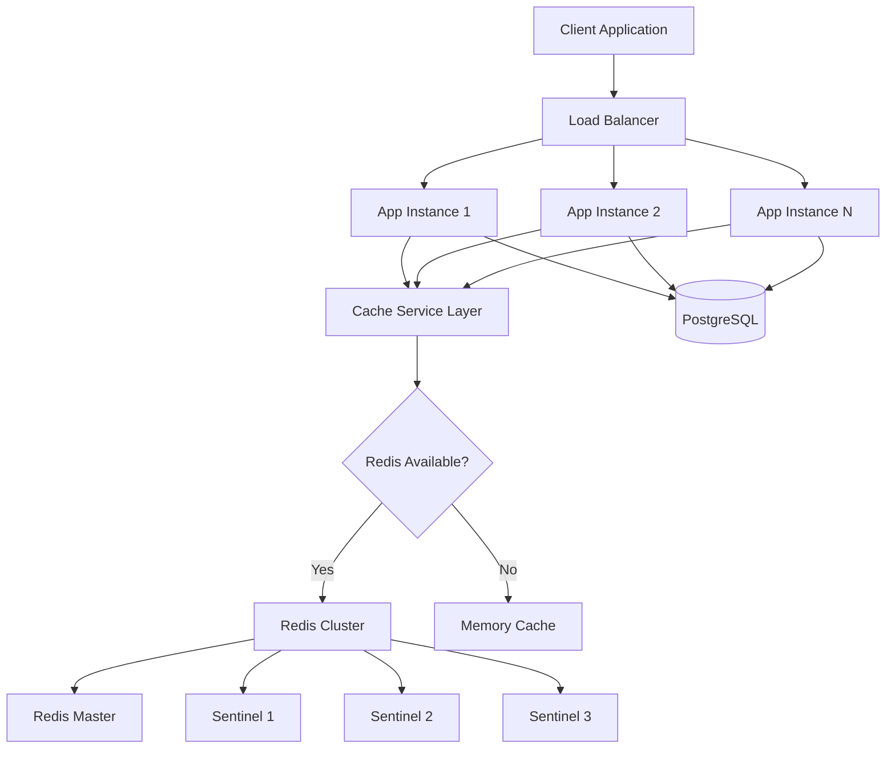
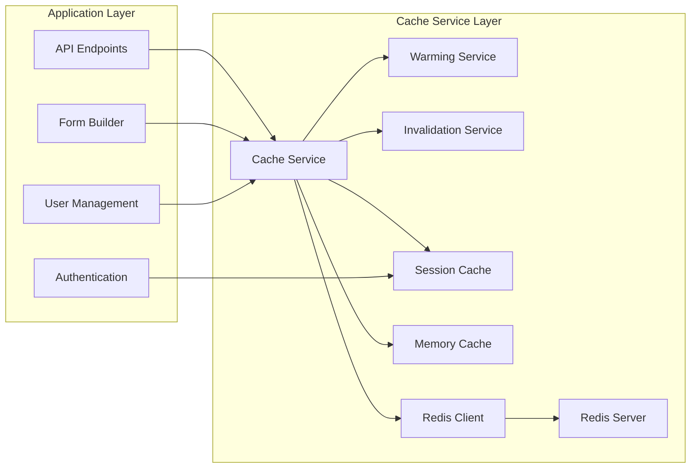
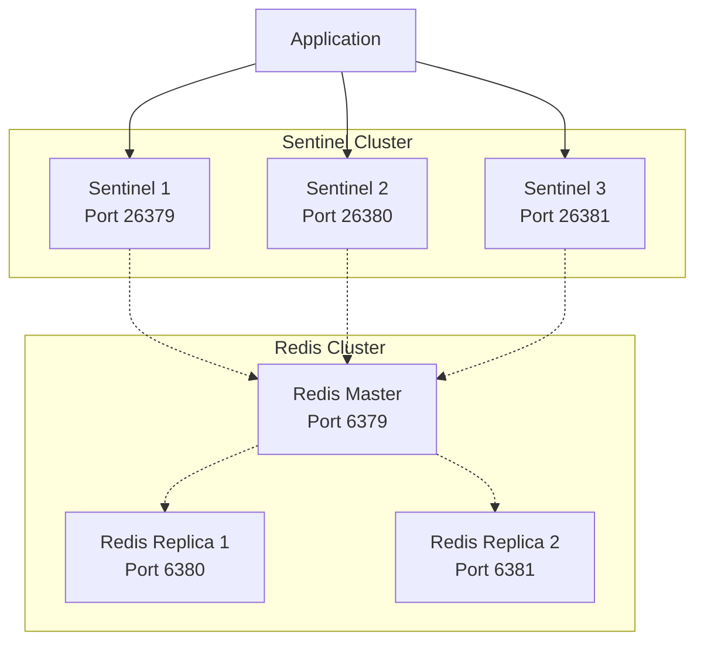
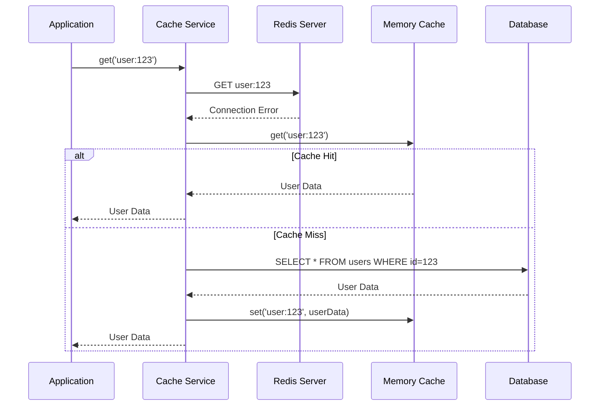
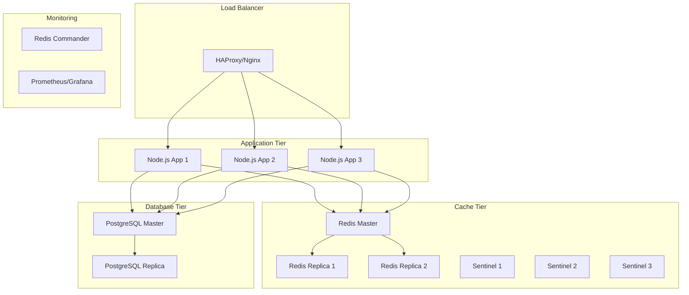
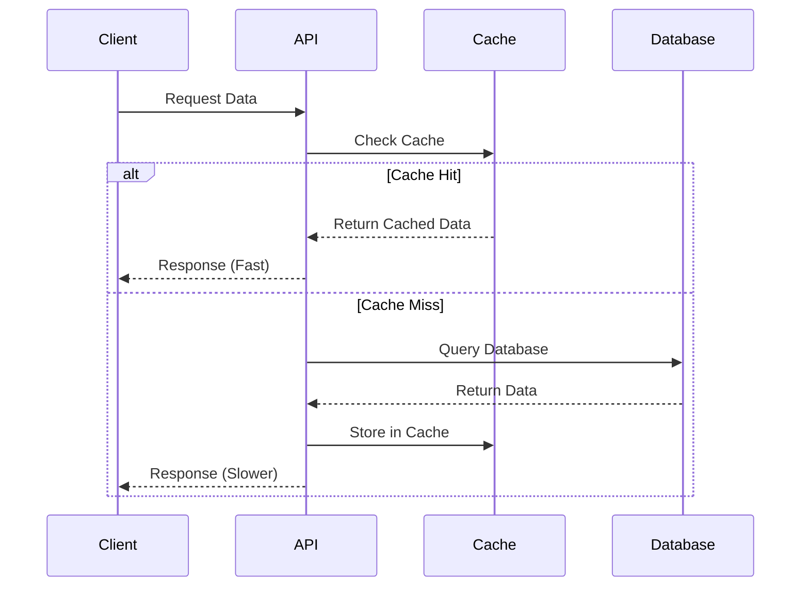
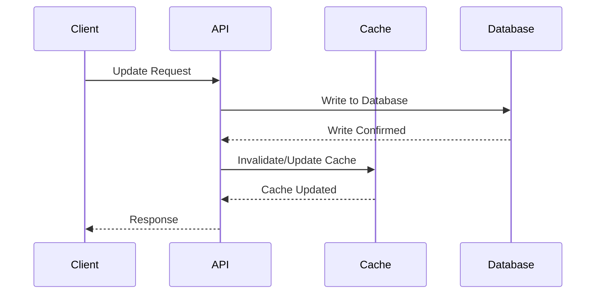
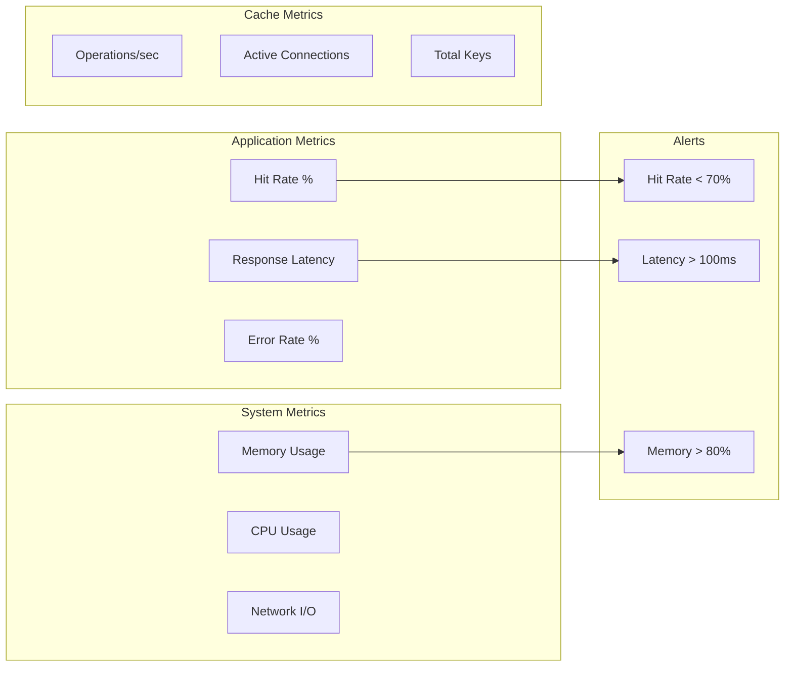
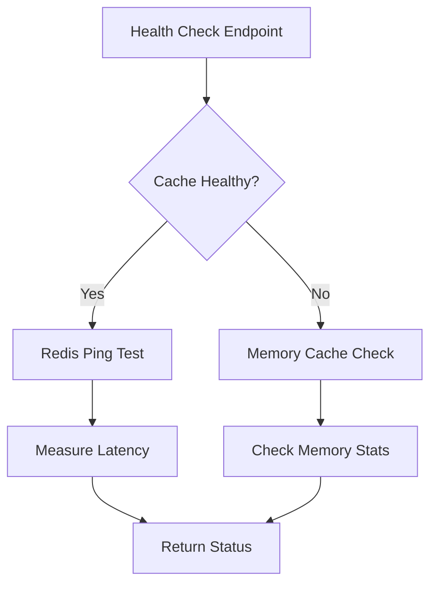
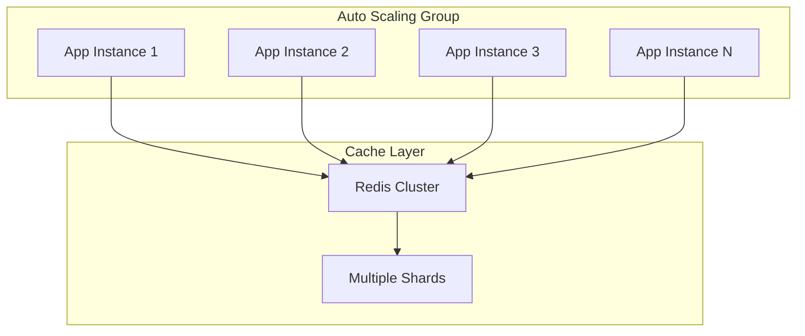

# Cache Architecture - XP Project

## Overview

The XP Project implements a sophisticated multi-layer caching architecture designed for high performance, reliability, and seamless fallback capabilities. The system automatically adapts between Redis and in-memory caching based on availability.

## System Architecture

### High-Level Architecture



### Cache Service Layer



## Component Architecture

### 1. Cache Service (`cacheService.ts`)

**Responsibilities:**
- Primary cache interface
- Mode detection (Redis vs Memory)
- Automatic fallback management
- Consistent API abstraction

**Key Features:**
- Dual-mode operation
- Graceful degradation
- Connection retry logic
- Health monitoring

```typescript
interface CacheService {
  get<T>(key: string, options?: CacheOptions): Promise<T | null>
  set(key: string, value: any, options?: CacheOptions): Promise<boolean>
  del(key: string | string[]): Promise<boolean>
  exists(key: string): Promise<boolean>
  healthCheck(): Promise<HealthStatus>
}
```

### 2. Memory Cache (`memoryCache.ts`)

**Responsibilities:**
- In-memory storage fallback
- Redis-compatible API
- TTL management
- LRU eviction

**Characteristics:**
- RAM-based storage (10K entries max)
- Automatic cleanup (1-minute intervals)
- Hit rate tracking
- Memory usage monitoring

### 3. Cache Warming Service (`cacheWarmingService.ts`)

**Responsibilities:**
- Pre-loading frequently accessed data
- Scheduled warming operations
- Performance optimization

**Warming Strategies:**
- Active users (last 24h)
- Popular forms (top 50)
- System configurations
- Recent sessions

### 4. Cache Invalidation Service (`cacheInvalidationService.ts`)

**Responsibilities:**
- Pattern-based invalidation
- Dependency tracking
- Cascade operations

**Invalidation Patterns:**
- By entity type (user, form, session)
- By pattern matching (wildcards)
- Dependency-based (cascading)
- Time-based (TTL expiration)

### 5. Session Cache Service (`sessionCacheService.ts`)

**Responsibilities:**
- High-performance session management
- User authentication caching
- Multi-session tracking

**Session Features:**
- Token-based caching
- User data pre-loading
- Activity tracking
- Expired session cleanup

## Performance Architecture

### Caching Layers

```
┌─────────────────────┐
│   Application       │ ← Business Logic
└──────────┬──────────┘
           │
┌──────────▼──────────┐
│   L1 Cache          │ ← Memory Cache (100ms)
│   (In-Memory)       │
└──────────┬──────────┘
           │ (Cache Miss)
┌──────────▼──────────┐
│   L2 Cache          │ ← Redis Cache (5-10ms)
│   (Redis)           │
└──────────┬──────────┘
           │ (Cache Miss)
┌──────────▼──────────┐
│   Database          │ ← PostgreSQL (50-200ms)
│   (PostgreSQL)      │
└─────────────────────┘
```

### Performance Metrics

| Operation | Memory Cache | Redis Cache | Database |
|-----------|-------------|-------------|----------|
| GET | <1ms | 5-10ms | 50-200ms |
| SET | <1ms | 5-10ms | 100-500ms |
| Capacity | ~10MB | 2GB | Unlimited |
| Persistence | No | Yes | Yes |
| Distribution | No | Yes | Yes |

## High Availability Architecture

### Redis Sentinel Configuration



**Failover Process:**
1. Sentinel detects master failure
2. Quorum reached (2/3 sentinels)
3. Leader election among replicas
4. Automatic failover to new master
5. Applications reconnect automatically

### Memory Cache Fallback



## Deployment Architecture

### Docker Compose Setup

```yaml
version: '3.8'
services:
  app:
    build: ./backend
    environment:
      - REDIS_ENABLED=true
      - REDIS_HOST=redis-master
    depends_on:
      - redis-master
      - postgres
  
  redis-master:
    image: redis:7.2-alpine
    command: redis-server --appendonly yes
  
  redis-sentinel-1:
    image: redis:7.2-alpine
    command: redis-sentinel /etc/redis/sentinel.conf
  
  postgres:
    image: postgres:15
```

### Production Architecture



## Data Flow Architecture

### Cache-First Strategy



### Write-Through Strategy



## Security Architecture

### Cache Security Layers

1. **Network Security**
   - Redis AUTH password
   - TLS encryption in production
   - VPC/network isolation

2. **Access Control**
   - Role-based cache access
   - API authentication
   - Admin-only management endpoints

3. **Data Protection**
   - No sensitive data in cache keys
   - TTL-based data expiration
   - Secure invalidation patterns

## Monitoring Architecture

### Key Metrics



### Health Check Flow



## Scalability Architecture

### Horizontal Scaling



### Performance Scaling

| Concurrent Users | Cache Strategy | Expected Performance |
|------------------|----------------|---------------------|
| 1-100 | Memory Cache | <50ms response |
| 100-1,000 | Single Redis | <100ms response |
| 1,000-10,000 | Redis Cluster | <150ms response |
| 10,000+ | Multi-tier + CDN | <200ms response |

## Future Architecture

### Planned Enhancements

1. **Redis Cluster** for horizontal scaling
2. **CDN Integration** for static content
3. **GraphQL Caching** for query optimization
4. **ML-based Cache Warming** for predictive loading
5. **Multi-region Replication** for global deployment

---

This architecture provides a robust, scalable, and maintainable caching solution that adapts to various deployment scenarios while maintaining high performance and reliability.