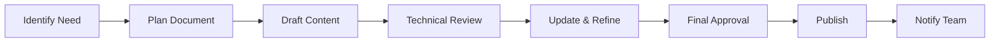

# QUY TẮC TUÂN THỦ VÀ QUẢN LÝ TÀI LIỆU DỰ ÁN

## 📋 MỤC LỤC

1. [Tổng Quan](#1-tổng-quan)
2. [Quy Tắc Tuân Thủ](#2-quy-tắc-tuân-thủ)
3. [Quy Trình Tạo Tài Liệu](#3-quy-trình-tạo-tài-liệu)
4. [Quy Trình Cập Nhật](#4-quy-trình-cập-nhật)
5. [Lưu Trữ và Quản Lý](#5-lưu-trữ-và-quản-lý)
6. [Kiểm Tra và Đánh Giá](#6-kiểm-tra-và-đánh-giá)

---

## 1. TỔNG QUAN

### 1.1 Mục Đích
Tài liệu này thiết lập các quy tắc và quy trình chuẩn cho việc tạo, cập nhật, và quản lý tài liệu trong dự án XP nhằm:
- Đảm bảo tính nhất quán và chất lượng
- Tăng cường khả năng bảo trì và mở rộng
- Hỗ trợ onboarding thành viên mới
- Tuân thủ các tiêu chuẩn quốc tế

### 1.2 Phạm Vi Áp Dụng
- Tất cả thành viên dự án
- Mọi loại tài liệu kỹ thuật và phi kỹ thuật
- Toàn bộ vòng đời phát triển phần mềm

## 2. QUY TẮC TUÂN THỦ

### 2.1 Tiêu Chuẩn Bắt Buộc

#### 2.1.1 Ngôn Ngữ
- **Tiếng Anh**: Cho code, API, technical docs
- **Tiếng Việt**: Cho user guides, business docs
- **Song ngữ**: Cho critical documentation

#### 2.1.2 Định Dạng
```markdown
# Tiêu đề chính (H1)
## Tiêu đề phụ (H2)
### Tiêu đề chi tiết (H3)

- Danh sách không thứ tự
1. Danh sách có thứ tự
`code inline`
```code block```
**bold** *italic*
[Link](url)
```

#### 2.1.3 Cấu Trúc File
```
docs/
├── 01-getting-started/     # Hướng dẫn bắt đầu
├── 02-architecture/         # Kiến trúc hệ thống
├── 03-features/             # Tính năng chi tiết
├── 04-api/                  # API documentation
├── 05-deployment/           # Triển khai
├── 06-testing/              # Kiểm thử
├── 07-troubleshooting/      # Xử lý sự cố
├── 08-development/          # Phát triển
├── 09-reports/              # Báo cáo
└── 10-compliance/           # Tuân thủ
```

### 2.2 Metadata Bắt Buộc

Mọi tài liệu phải có header metadata:

```yaml
---
title: [Tiêu đề tài liệu]
version: [Phiên bản]
date: [YYYY-MM-DD]
author: [Tên tác giả]
reviewer: [Người review]
status: [draft|review|approved|deprecated]
tags: [tag1, tag2]
---
```

### 2.3 Quy Tắc Nội Dung

#### 2.3.1 Rõ Ràng và Súc Tích
- Câu ngắn gọn, dễ hiểu
- Tránh thuật ngữ không cần thiết
- Giải thích acronyms lần đầu sử dụng

#### 2.3.2 Tính Chính Xác
- Thông tin phải được verify
- Code examples phải test được
- Links phải hoạt động

#### 2.3.3 Tính Đầy Đủ
- Cover tất cả use cases
- Bao gồm edge cases
- Có troubleshooting section

## 3. QUY TRÌNH TẠO TÀI LIỆU

### 3.1 Workflow Tạo Mới



### 3.2 Checklist Tạo Tài Liệu

#### Phase 1: Planning
- [ ] Xác định target audience
- [ ] Define scope và objectives
- [ ] Research existing documentation
- [ ] Create outline structure

#### Phase 2: Writing
- [ ] Write first draft
- [ ] Add code examples
- [ ] Include diagrams/screenshots
- [ ] Add cross-references

#### Phase 3: Review
- [ ] Technical accuracy review
- [ ] Grammar và spelling check
- [ ] Format consistency check
- [ ] Test all examples

#### Phase 4: Publishing
- [ ] Add metadata header
- [ ] Update index/TOC
- [ ] Commit với descriptive message
- [ ] Create announcement

### 3.3 Templates

#### 3.3.1 Feature Documentation Template
```markdown
# [Feature Name]

## Overview
[Brief description]

## Use Cases
- Use case 1
- Use case 2

## Implementation
### Prerequisites
### Step-by-step Guide
### Code Examples

## API Reference
### Endpoints
### Parameters
### Response Format

## Testing
### Unit Tests
### Integration Tests

## Troubleshooting
### Common Issues
### FAQ

## References
- Related docs
- External resources
```

#### 3.3.2 API Documentation Template
```markdown
# API: [Endpoint Name]

## Endpoint
`[METHOD] /api/path`

## Description
[What it does]

## Authentication
[Required permissions]

## Parameters
| Name | Type | Required | Description |
|------|------|----------|-------------|
| param1 | string | Yes | Description |

## Request Example
```json
{
  "field": "value"
}
```

## Response
### Success (200)
```json
{
  "status": "success",
  "data": {}
}
```

### Error Codes
| Code | Description |
|------|-------------|
| 400 | Bad Request |
| 401 | Unauthorized |
```

## 4. QUY TRÌNH CẬP NHẬT

### 4.1 Trigger Points
Tài liệu PHẢI được cập nhật khi:
- Code thay đổi affecting behavior
- API contracts thay đổi
- New features được thêm
- Bugs được fix với workarounds
- Dependencies được update
- Security patches được apply

### 4.2 Update Workflow

```yaml
1. Identify Change:
   - Monitor code changes
   - Track feature requests
   - Review bug reports

2. Assess Impact:
   - Determine affected docs
   - Evaluate urgency
   - Assign responsibility

3. Update Content:
   - Make necessary changes
   - Update version number
   - Add changelog entry

4. Review Process:
   - Technical review
   - Peer review
   - Stakeholder approval

5. Deploy Updates:
   - Commit changes
   - Update indexes
   - Notify affected parties
```

### 4.3 Version Control

#### Semantic Versioning cho Docs
- **Major** (X.0.0): Structural changes
- **Minor** (0.X.0): New content additions
- **Patch** (0.0.X): Fixes và clarifications

#### Changelog Format
```markdown
## [Version] - YYYY-MM-DD
### Added
- New sections
### Changed
- Updates to existing content
### Fixed
- Error corrections
### Removed
- Deprecated content
```

## 5. LƯU TRỮ VÀ QUẢN LÝ

### 5.1 Repository Structure

```
project-root/
├── docs/                    # Main documentation
│   ├── README.md           # Documentation index
│   ├── CHANGELOG.md        # Documentation changelog
│   └── [categories]/       # Organized by topic
├── api-docs/               # Auto-generated API docs
├── user-guides/            # End-user documentation
└── internal/               # Internal team docs
```

### 5.2 Naming Conventions

#### Files
- **Format**: `kebab-case.md`
- **Prefixes**: 
  - `guide-` for guides
  - `api-` for API docs
  - `spec-` for specifications
  - `report-` for reports

#### Directories
- Lowercase với hyphens
- Numbered cho ordered sections
- Descriptive names

### 5.3 Git Practices

#### Commit Messages
```
docs: [action] [scope] - [description]

Examples:
docs: add user-management guide - comprehensive CRUD operations
docs: update api-auth - add refresh token endpoint
docs: fix deployment guide - correct Docker commands
```

#### Branching
- `docs/feature-name` cho new docs
- `docs/fix-issue` cho corrections
- `docs/update-section` cho updates

### 5.4 Backup và Archive

#### Backup Strategy
- Daily automated backups
- Version control trong Git
- Cloud storage redundancy

#### Archive Policy
- Keep last 3 major versions
- Archive deprecated docs trong `/archive`
- Maintain redirect links

## 6. KIỂM TRA VÀ ĐÁNH GIÁ

### 6.1 Quality Metrics

#### Định Lượng
- **Completeness**: 100% features documented
- **Accuracy**: <5% error rate
- **Currency**: Updated within 48h of changes
- **Coverage**: >90% use cases covered

#### Định Tính
- Clarity và readability
- User satisfaction
- Team feedback
- Onboarding effectiveness

### 6.2 Review Checklist

#### Technical Review
- [ ] Code examples work
- [ ] APIs accurately described
- [ ] Dependencies correct
- [ ] Security considerations included

#### Editorial Review
- [ ] Grammar và spelling
- [ ] Formatting consistency
- [ ] Links functional
- [ ] Images/diagrams clear

#### Compliance Review
- [ ] Follows templates
- [ ] Metadata complete
- [ ] Versioning correct
- [ ] Indexed properly

### 6.3 Continuous Improvement

#### Monthly Reviews
- Analyze documentation metrics
- Gather user feedback
- Identify gaps
- Plan improvements

#### Quarterly Audits
- Full documentation audit
- Update outdated content
- Remove deprecated docs
- Optimize structure

## 7. CÔNG CỤ HỖ TRỢ

### 7.1 Documentation Tools
- **Markdown Editors**: VSCode, Typora
- **Diagram Tools**: Draw.io, Mermaid
- **API Docs**: Swagger, Postman
- **Screenshots**: ShareX, Lightshot

### 7.2 Automation
- **Linting**: markdownlint
- **Link Checking**: markdown-link-check
- **Spell Check**: cspell
- **Format**: Prettier

### 7.3 Templates và Resources
- `/docs/templates/` - Document templates
- `/docs/examples/` - Example documents
- `/docs/style-guide.md` - Style guidelines
- `/docs/glossary.md` - Term definitions

## 8. RESPONSIBILITY MATRIX

| Role | Create | Review | Approve | Maintain |
|------|--------|--------|---------|----------|
| Developer | ✅ | ✅ | ❌ | ✅ |
| Tech Lead | ✅ | ✅ | ✅ | ✅ |
| QA | ⚡ | ✅ | ❌ | ⚡ |
| PM | ⚡ | ✅ | ✅ | ❌ |

Legend: ✅ Primary | ⚡ Secondary | ❌ Not Required

## 9. ENFORCEMENT

### 9.1 Compliance Monitoring
- Automated checks trong CI/CD
- Weekly documentation reviews
- Monthly compliance reports

### 9.2 Non-Compliance Handling
1. **First Offense**: Reminder và guidance
2. **Second Offense**: Required training
3. **Repeated**: Escalation to management

### 9.3 Recognition
- Monthly "Best Documentation" award
- Contribution tracking
- Performance review inclusion

## 10. TRAINING VÀ SUPPORT

### 10.1 Onboarding
- Documentation writing workshop
- Template walkthrough
- Tool training

### 10.2 Ongoing Support
- Documentation channel trong Slack
- Weekly office hours
- Peer review sessions

### 10.3 Resources
- [Writing Effective Documentation](./guides/writing-guide.md)
- [Markdown Best Practices](./guides/markdown-guide.md)
- [API Documentation Standards](./guides/api-docs-guide.md)

---

## PHỤ LỤC

### A. Quick Reference Cards
- [Markdown Cheat Sheet](./references/markdown-cheat-sheet.md)
- [Git Commands for Docs](./references/git-docs-commands.md)
- [Review Checklist](./references/review-checklist.md)

### B. Contact Information
- **Documentation Lead**: [Email]
- **Technical Writers**: [Team Email]
- **Support Channel**: #docs-support

### C. Change Log
| Version | Date | Changes | Author |
|---------|------|---------|--------|
| 1.0.0 | 2025-01-10 | Initial release | Team |

---

**Lưu ý**: Tài liệu này là living document và sẽ được cập nhật thường xuyên. Vui lòng check version mới nhất trước khi sử dụng.

**Effective Date**: 2025-01-10  
**Next Review**: 2025-04-10  
**Document Owner**: Development Team