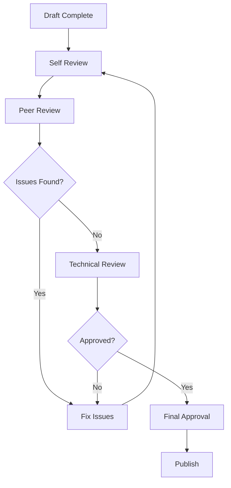

# HỆ THỐNG QUẢN LÝ TÀI LIỆU DỰ ÁN XP

## 📚 TỔNG QUAN HỆ THỐNG

### Mục Tiêu
Xây dựng hệ thống quản lý tài liệu chuyên nghiệp, tự động hóa và dễ bảo trì cho dự án XP.

### Nguyên Tắc Core
1. **Documentation as Code** - Tài liệu được quản lý như code
2. **Single Source of Truth** - Một nguồn duy nhất cho mỗi thông tin
3. **Automation First** - Tự động hóa mọi thứ có thể
4. **Version Control** - Kiểm soát phiên bản chặt chẽ
5. **Continuous Updates** - Cập nhật liên tục và kịp thời

## 🔄 QUY TRÌNH VÒNG ĐỜI TÀI LIỆU

### 1. KHỞI TẠO (Initialization)

#### 1.1 Yêu Cầu Tài Liệu Mới
```yaml
Trigger Points:
  - New feature development
  - API endpoint creation
  - Bug fix với workaround
  - Architecture changes
  - Security updates
  
Required Information:
  - Purpose và scope
  - Target audience
  - Priority level
  - Deadline
  - Responsible person
```

#### 1.2 Documentation Request Form
```markdown
## Documentation Request
**Request ID**: DOC-[YYYY-MM-DD]-[XXX]
**Requestor**: [Name]
**Date**: [YYYY-MM-DD]
**Priority**: [High|Medium|Low]

### Details
- **Type**: [Feature|API|Guide|Report]
- **Component**: [Module name]
- **Description**: [What needs documenting]
- **Audience**: [Developers|Users|Admins]
- **Deadline**: [Date]
```

### 2. PHÁT TRIỂN (Development)

#### 2.1 Research và Planning
```markdown
1. Gather Information
   - Interview stakeholders
   - Review code changes
   - Analyze requirements
   - Check existing docs

2. Create Outline
   - Define structure
   - Identify sections
   - Plan examples
   - List references
```

#### 2.2 Writing Process
```markdown
## Best Practices
- Use active voice
- Write in present tense
- Include practical examples
- Add visual aids when helpful
- Cross-reference related docs
```

#### 2.3 Code Documentation Standards
```typescript
/**
 * @description Calculate total price with tax
 * @param {number} price - Base price
 * @param {number} taxRate - Tax rate as decimal
 * @returns {number} Total price including tax
 * @example
 * calculateTotal(100, 0.1) // Returns 110
 * @throws {Error} If price is negative
 * @since v1.2.0
 */
function calculateTotal(price: number, taxRate: number): number {
  if (price < 0) throw new Error('Price cannot be negative');
  return price * (1 + taxRate);
}
```

### 3. REVIEW VÀ APPROVAL

#### 3.1 Review Process


#### 3.2 Review Checklist
```markdown
## Technical Review
- [ ] Code examples tested
- [ ] API endpoints verified
- [ ] Dependencies checked
- [ ] Security considerations
- [ ] Performance impacts

## Content Review
- [ ] Accuracy verified
- [ ] Completeness checked
- [ ] Grammar/spelling
- [ ] Formatting consistent
- [ ] Links working

## Compliance Review
- [ ] Follows templates
- [ ] Metadata complete
- [ ] Properly indexed
- [ ] Version tagged
```

### 4. PUBLISHING

#### 4.1 Pre-Publishing Checklist
```bash
# Automated checks before publishing
npm run docs:lint          # Check markdown syntax
npm run docs:links         # Verify all links
npm run docs:spell         # Spell check
npm run docs:format        # Format consistency
```

#### 4.2 Publishing Workflow
```yaml
Steps:
  1. Final review pass
  2. Update version number
  3. Add to changelog
  4. Update indexes/TOC
  5. Commit to repository
  6. Deploy to docs site
  7. Notify stakeholders
  8. Monitor feedback
```

### 5. MAINTENANCE

#### 5.1 Update Triggers
| Event | Action Required | Timeline |
|-------|----------------|----------|
| Code change | Update affected docs | 48 hours |
| Bug report | Add to troubleshooting | 24 hours |
| Feature release | Full documentation | Before release |
| Security issue | Immediate update | ASAP |
| User feedback | Review and update | 1 week |

#### 5.2 Maintenance Schedule
```yaml
Daily:
  - Check for broken links
  - Monitor user feedback
  
Weekly:
  - Review recent changes
  - Update FAQs
  
Monthly:
  - Full content audit
  - Update examples
  - Archive old versions
  
Quarterly:
  - Major version review
  - Restructure if needed
  - Training materials update
```

## 📂 CẤU TRÚC LƯU TRỮ

### Directory Structure
```
docs/
├── architecture/           # System architecture
│   ├── overview.md
│   ├── components/
│   └── diagrams/
├── api/                   # API documentation
│   ├── rest/
│   ├── graphql/
│   └── websocket/
├── guides/                # User guides
│   ├── getting-started/
│   ├── tutorials/
│   └── best-practices/
├── features/              # Feature documentation
│   ├── authentication/
│   ├── form-builder/
│   └── comments/
├── deployment/            # Deployment docs
│   ├── docker/
│   ├── kubernetes/
│   └── ci-cd/
├── troubleshooting/       # Problem solving
│   ├── common-issues/
│   ├── faqs/
│   └── support/
└── internal/              # Internal docs
    ├── processes/
    ├── standards/
    └── templates/
```

### File Naming Convention
```
Format: [category]-[topic]-[subtopic].md

Examples:
- api-auth-login.md
- guide-form-builder-advanced.md
- troubleshooting-database-connection.md
```

## 🔧 TOOLS VÀ AUTOMATION

### Documentation Generation Tools
```json
{
  "tools": {
    "api-docs": "swagger-jsdoc",
    "typescript": "typedoc",
    "markdown": "docsify",
    "diagrams": "mermaid",
    "screenshots": "puppeteer"
  }
}
```

### Automation Scripts
```bash
# Generate API docs from code
npm run docs:generate-api

# Create changelog from commits
npm run docs:changelog

# Build static site
npm run docs:build

# Deploy to production
npm run docs:deploy
```

### CI/CD Integration
```yaml
# .github/workflows/docs.yml
name: Documentation Pipeline
on:
  push:
    paths:
      - 'docs/**'
      - 'src/**'
jobs:
  validate:
    runs-on: ubuntu-latest
    steps:
      - uses: actions/checkout@v2
      - name: Validate Documentation
        run: |
          npm run docs:lint
          npm run docs:links
          npm run docs:test
  
  build:
    needs: validate
    runs-on: ubuntu-latest
    steps:
      - name: Build Documentation
        run: npm run docs:build
      
  deploy:
    needs: build
    if: github.ref == 'refs/heads/main'
    runs-on: ubuntu-latest
    steps:
      - name: Deploy to GitHub Pages
        run: npm run docs:deploy
```

## 📊 METRICS VÀ KPIs

### Documentation Health Metrics
```yaml
Coverage:
  target: 95%
  formula: (documented_features / total_features) * 100

Currency:
  target: <7 days
  measure: average_age_since_last_update

Quality:
  target: >4.0/5.0
  measure: user_satisfaction_score

Completeness:
  target: 100%
  checklist:
    - Overview section
    - Use cases
    - Examples
    - API reference
    - Troubleshooting

Usage:
  track:
    - Page views
    - Search queries
    - Time on page
    - Bounce rate
```

### Monthly Report Template
```markdown
# Documentation Report - [Month Year]

## Metrics Summary
- Coverage: X%
- Currency: X days average
- Quality Score: X/5
- New Docs: X
- Updated Docs: X

## Highlights
- Major updates
- New features documented
- Issues resolved

## Action Items
- Planned improvements
- Pending reviews
- Training needs
```

## 🎓 TRAINING VÀ SUPPORT

### Onboarding Program
```yaml
Week 1:
  - Documentation overview
  - Tools training
  - Template walkthrough
  
Week 2:
  - Write first document
  - Peer review practice
  - Git workflow

Week 3:
  - Advanced techniques
  - Automation tools
  - Best practices
```

### Support Resources
```markdown
## Documentation Team
- Lead: [Name] - [Email]
- Technical Writers: [Team Email]
- Slack: #docs-support
- Office Hours: Tue/Thu 2-3pm

## Self-Service Resources
- [Writing Guide](./guides/writing-guide.md)
- [Template Library](./templates/)
- [Video Tutorials](./tutorials/)
- [FAQ](./faq.md)
```

## 🔒 SECURITY VÀ COMPLIANCE

### Security Guidelines
```yaml
Sensitive Information:
  - Never include passwords
  - Mask API keys
  - Anonymize user data
  - Remove internal URLs

Access Control:
  - Public docs: GitHub Pages
  - Internal docs: Confluence
  - Confidential: Encrypted storage

Review Requirements:
  - Security team approval for:
    - Authentication docs
    - API documentation
    - Infrastructure guides
```

### Compliance Checklist
```markdown
## Legal Compliance
- [ ] No copyrighted content
- [ ] Proper attributions
- [ ] License compatibility
- [ ] GDPR compliance

## Industry Standards
- [ ] ISO 9001 alignment
- [ ] WCAG accessibility
- [ ] OpenAPI specification
- [ ] Semantic versioning
```

## 📈 CONTINUOUS IMPROVEMENT

### Feedback Collection
```yaml
Methods:
  - Documentation surveys
  - User interviews
  - Analytics tracking
  - Support ticket analysis
  - Team retrospectives

Action Process:
  1. Collect feedback monthly
  2. Analyze patterns
  3. Prioritize improvements
  4. Implement changes
  5. Measure impact
```

### Innovation Initiatives
```markdown
## Current Projects
1. AI-powered documentation search
2. Interactive API playground
3. Video documentation series
4. Multilingual support
5. Real-time collaboration

## Future Plans
- Voice-activated docs
- AR/VR tutorials
- Personalized learning paths
- Automated translation
- Smart suggestions
```

---

## APPENDIX

### A. Templates
- [Feature Documentation](./templates/feature-doc.md)
- [API Documentation](./templates/api-doc.md)
- [Troubleshooting Guide](./templates/troubleshooting.md)
- [Release Notes](./templates/release-notes.md)

### B. Tools Configuration
- [Docsify Setup](./config/docsify.md)
- [Swagger Config](./config/swagger.md)
- [TypeDoc Settings](./config/typedoc.md)

### C. Emergency Procedures
```markdown
## Documentation Emergency Response
1. Critical bug discovered
   - Update troubleshooting immediately
   - Send notification to users
   - Create hotfix documentation

2. Security vulnerability
   - Coordinate with security team
   - Update affected documentation
   - Publish security advisory

3. Major outage
   - Update status page
   - Document workarounds
   - Post-mortem documentation
```

---

**Version**: 1.0.0  
**Last Updated**: 2025-01-10  
**Next Review**: 2025-04-10  
**Maintained By**: XP Development Team