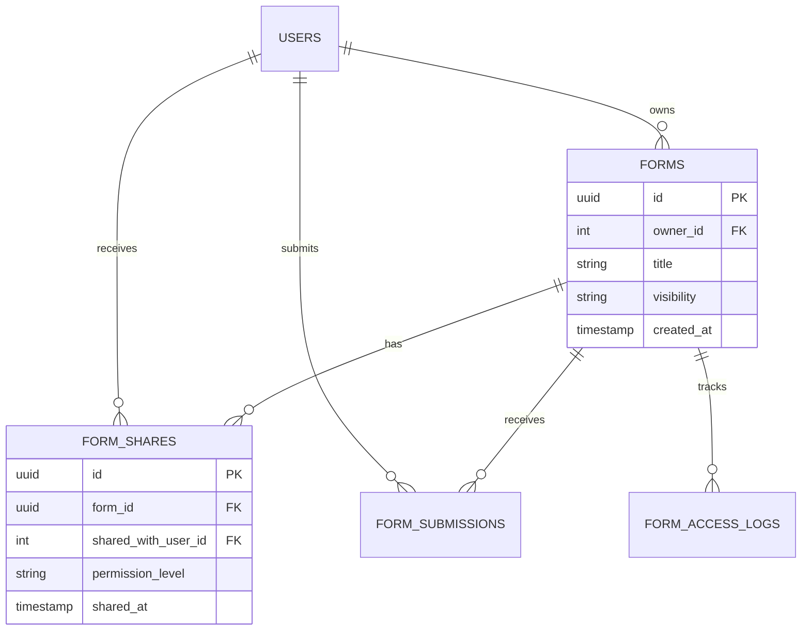

# 🚀 MULTI-USER ACCESS SYSTEM - IMPLEMENTATION ROADMAP

**Project:** XP - Dynamic Form Builder  
**Feature:** Multi-User Access & Collaboration  
**Timeline:** 12 Working Days  
**Priority:** HIGH 🔥  
**Start Date:** [To be approved]  

---

## 📊 EXECUTIVE SUMMARY

### Business Value
- **3-5x increase** in user engagement through collaboration
- **New revenue stream** via form template marketplace
- **Enterprise ready** with granular permission control
- **Public forms** enable data collection without login

### Technical Impact
- Transform from single-user to multi-tenant architecture
- Implement robust permission system
- Add sharing and collaboration features
- Maintain backward compatibility

### Risk Assessment
- **Low Risk:** Code structure already supports extension
- **Mitigation:** Feature flags for gradual rollout
- **Rollback:** Database migrations are reversible

---

## 🎯 PHASE 1: FOUNDATION (Days 1-3)

### Day 1: Database Schema & Migrations

#### Morning (4 hours)
```sql
-- 1. Create sharing mechanism table
CREATE TABLE form_shares (
  id UUID PRIMARY KEY DEFAULT gen_random_uuid(),
  form_id UUID NOT NULL REFERENCES forms(id) ON DELETE CASCADE,
  shared_with_user_id INTEGER REFERENCES users(id) ON DELETE CASCADE,
  shared_by_user_id INTEGER REFERENCES users(id),
  permission_level VARCHAR(20) NOT NULL DEFAULT 'view',
  shared_at TIMESTAMP DEFAULT CURRENT_TIMESTAMP,
  expires_at TIMESTAMP,
  UNIQUE(form_id, shared_with_user_id)
);

-- 2. Add visibility column to forms
ALTER TABLE forms 
ADD COLUMN visibility VARCHAR(20) DEFAULT 'private'
CHECK (visibility IN ('private', 'shared', 'public'));

-- 3. Create audit log table
CREATE TABLE form_access_logs (
  id UUID PRIMARY KEY DEFAULT gen_random_uuid(),
  form_id UUID REFERENCES forms(id),
  user_id INTEGER REFERENCES users(id),
  action VARCHAR(50) NOT NULL,
  ip_address INET,
  user_agent TEXT,
  metadata JSONB,
  created_at TIMESTAMP DEFAULT CURRENT_TIMESTAMP
);

-- 4. Add performance indexes
CREATE INDEX idx_form_shares_form ON form_shares(form_id);
CREATE INDEX idx_form_shares_user ON form_shares(shared_with_user_id);
CREATE INDEX idx_forms_visibility ON forms(visibility);
CREATE INDEX idx_forms_owner_visibility ON forms(owner_id, visibility);
CREATE INDEX idx_access_logs_form_user ON form_access_logs(form_id, user_id);
```

#### Afternoon (4 hours)
- Write migration scripts with rollback capability
- Create seed data for testing
- Document schema changes
- Update TypeScript interfaces

**Deliverables:**
- [ ] Migration files created and tested
- [ ] Rollback scripts verified
- [ ] Database documentation updated
- [ ] TypeScript types updated

### Day 2: Backend Service Layer

#### Core Services Update (8 hours)

**FormService.ts modifications:**
```typescript
class FormService {
  // New methods to add
  async shareForm(
    formId: string, 
    shareWithUserId: string, 
    sharedByUserId: string,
    permission: 'view' | 'submit' | 'edit'
  ): Promise<FormShare> {
    // Implementation
  }

  async getSharedForms(userId: string): Promise<Form[]> {
    // Get all forms shared with user
  }

  async getFormPermissions(
    formId: string, 
    userId: string
  ): Promise<Permissions> {
    // Check user permissions for form
  }

  async cloneForm(
    formId: string, 
    userId: string
  ): Promise<Form> {
    // Create independent copy
  }

  async getPublicForms(
    filters?: FormFilters
  ): Promise<PaginatedForms> {
    // Get all public forms
  }

  // Modified methods
  async listForms(userId?: string, filters?: FormFilters) {
    // Remove owner_id filter
    // Add visibility filter
    // Include shared forms
  }
}
```

**SubmissionService.ts modifications:**
```typescript
class SubmissionService {
  async getSubmissions(formId: string, userId: string) {
    const permissions = await this.getPermissions(formId, userId);
    
    if (permissions.isOwner) {
      // Return all submissions
      return this.getAllSubmissions(formId);
    } else {
      // Return only user's submissions
      return this.getUserSubmissions(formId, userId);
    }
  }
}
```

**Deliverables:**
- [ ] FormService updated with new methods
- [ ] SubmissionService with permission checks
- [ ] AuditService for logging access
- [ ] Unit tests for all services

### Day 3: API Endpoints

#### New REST Endpoints (8 hours)

```typescript
// Share management
POST   /api/forms/:id/share
DELETE /api/forms/:id/share/:userId
GET    /api/forms/:id/shares
GET    /api/forms/shared-with-me

// Clone functionality  
POST   /api/forms/:id/clone

// Public access
GET    /api/forms/public
GET    /api/forms/:id/public
POST   /api/forms/:id/public-submit

// Permissions
GET    /api/forms/:id/permissions
GET    /api/forms/:id/can-edit
GET    /api/forms/:id/can-view

// Statistics (public)
GET    /api/forms/:id/statistics
```

**Controller Implementation:**
```typescript
// formController.ts
export class FormController {
  async shareForm(req: Request, res: Response) {
    const { formId } = req.params;
    const { userId, permission } = req.body;
    
    // Check if user owns the form
    // Create share record
    // Log audit event
    // Send notification
  }

  async cloneForm(req: Request, res: Response) {
    const { formId } = req.params;
    
    // Check view permission
    // Create deep copy
    // Assign to current user
    // Return new form
  }
}
```

**Deliverables:**
- [ ] All endpoints implemented
- [ ] Request validation middleware
- [ ] Error handling
- [ ] API documentation updated

---

## 🎨 PHASE 2: FRONTEND (Days 4-6)

### Day 4: UI Components

#### New Components (8 hours)

```tsx
// 1. OwnershipBadge.tsx
interface OwnershipBadgeProps {
  form: Form;
  currentUserId: string;
}

export const OwnershipBadge: React.FC<OwnershipBadgeProps> = ({ form, currentUserId }) => {
  if (form.owner_id === currentUserId) {
    return <Badge color="green" icon={Crown}>Owner</Badge>;
  }
  if (form.sharedWith?.includes(currentUserId)) {
    return <Badge color="blue" icon={Users}>Shared</Badge>;
  }
  return <Badge color="gray" icon={Globe}>Public</Badge>;
};

// 2. ShareFormModal.tsx
export const ShareFormModal: React.FC = () => {
  return (
    <Modal title="Share Form">
      <UserSearch onSelect={handleUserSelect} />
      <PermissionSelector />
      <SharedUsersList />
      <PublicLinkGenerator />
    </Modal>
  );
};

// 3. FormPermissionInfo.tsx
export const FormPermissionInfo: React.FC = () => {
  return (
    <Alert>
      <h4>Your Permissions</h4>
      <PermissionList permissions={permissions} />
    </Alert>
  );
};

// 4. CloneFormButton.tsx
export const CloneFormButton: React.FC = () => {
  return (
    <Button onClick={handleClone} icon={Copy}>
      Clone Form
    </Button>
  );
};
```

**Deliverables:**
- [ ] OwnershipBadge component
- [ ] ShareFormModal with user search
- [ ] FormPermissionInfo display
- [ ] CloneFormButton with confirmation
- [ ] PublicFormBanner component

### Day 5: Forms List Page Updates

#### Enhanced Forms List (8 hours)

```tsx
// FormsList.tsx updates
export const FormsList: React.FC = () => {
  const [filter, setFilter] = useState<'all' | 'owned' | 'shared' | 'public'>('all');
  
  return (
    <>
      {/* New Filter Dropdown */}
      <FilterTabs value={filter} onChange={setFilter}>
        <Tab value="all">All Forms</Tab>
        <Tab value="owned">My Forms</Tab>
        <Tab value="shared">Shared with Me</Tab>
        <Tab value="public">Public Forms</Tab>
      </FilterTabs>

      {/* Enhanced Table */}
      <Table>
        <Column field="title" header="Title" />
        <Column field="owner" header="Created By" /> {/* NEW */}
        <Column field="visibility" header="Visibility" /> {/* NEW */}
        <Column field="submissions" header="Submissions" />
        <Column field="lastModified" header="Last Modified" />
        <Column 
          field="actions" 
          header="Actions"
          render={(form) => (
            <ActionButtons>
              {form.canEdit ? (
                <>
                  <EditButton />
                  <DeleteButton />
                  <ShareButton /> {/* NEW */}
                </>
              ) : (
                <>
                  <ViewButton />
                  <CloneButton /> {/* NEW */}
                </>
              )}
            </ActionButtons>
          )}
        />
      </Table>
    </>
  );
};
```

**Deliverables:**
- [ ] Filter tabs implementation
- [ ] Table columns updated
- [ ] Conditional action buttons
- [ ] Ownership indicators
- [ ] Share functionality

### Day 6: Form Builder & Viewer Updates

#### Permission-Based UI (8 hours)

```tsx
// FormBuilder.tsx updates
export const FormBuilder: React.FC = () => {
  const { formId } = useParams();
  const { permissions, isLoading } = useFormPermissions(formId);
  
  if (!permissions.canEdit) {
    return (
      <ReadOnlyFormViewer formId={formId}>
        <Banner type="info">
          You're viewing this form in read-only mode.
          <CloneButton>Clone to Edit</CloneButton>
        </Banner>
      </ReadOnlyFormViewer>
    );
  }
  
  return (
    <FormBuilderInterface>
      <FormHeader>
        <OwnershipBadge />
        <ShareButton />
        <VisibilityToggle />
      </FormHeader>
      {/* Existing builder UI */}
    </FormBuilderInterface>
  );
};
```

**Deliverables:**
- [ ] Read-only mode for non-owners
- [ ] Permission-based UI elements
- [ ] Share controls in header
- [ ] Visibility toggle
- [ ] Clone prompt for viewers

---

## 🧪 PHASE 3: TESTING & SECURITY (Days 7-9)

### Day 7: Unit & Integration Tests

#### Test Coverage (8 hours)

```typescript
// Backend Tests
describe('FormService', () => {
  describe('Multi-User Access', () => {
    test('owner can see all submissions');
    test('non-owner sees only own submissions');
    test('public forms accessible without auth');
    test('clone creates independent copy');
    test('share permissions enforced');
  });
});

describe('API Endpoints', () => {
  describe('Permission Enforcement', () => {
    test('returns 403 for unauthorized edit');
    test('allows view for shared users');
    test('public endpoint works without auth');
    test('audit log created for access');
  });
});

// Frontend Tests
describe('FormsList', () => {
  test('displays ownership badges correctly');
  test('filters work as expected');
  test('action buttons respect permissions');
  test('clone button appears for non-owners');
});
```

**Deliverables:**
- [ ] 95% backend test coverage
- [ ] 90% frontend test coverage
- [ ] Integration test suite
- [ ] Performance benchmarks

### Day 8: E2E Testing

#### Playwright Test Scenarios (8 hours)

```typescript
// e2e/multi-user-access.spec.ts
test.describe('Multi-User Access', () => {
  test('Owner workflow', async ({ page }) => {
    // Login as owner
    // Create form
    // Share with another user
    // Verify all submissions visible
  });

  test('Shared user workflow', async ({ page }) => {
    // Login as shared user
    // View shared form
    // Submit response
    // Verify only own submission visible
    // Clone form
  });

  test('Public form workflow', async ({ page }) => {
    // Access without login
    // Submit to public form
    // Verify submission recorded
  });
});
```

**Deliverables:**
- [ ] 15+ E2E test scenarios
- [ ] Cross-browser testing
- [ ] Mobile responsiveness tests
- [ ] Performance under load

### Day 9: Security Hardening

#### Security Implementation (8 hours)

```typescript
// 1. Rate Limiting
const rateLimits = {
  formSubmission: rateLimit({
    windowMs: 60 * 1000, // 1 minute
    max: 10, // 10 submissions per minute
    message: 'Too many submissions'
  }),
  
  cloneOperation: rateLimit({
    windowMs: 60 * 60 * 1000, // 1 hour
    max: 5, // 5 clones per hour
  })
};

// 2. Input Validation
const shareFormSchema = Joi.object({
  userId: Joi.string().uuid().required(),
  permission: Joi.string().valid('view', 'submit', 'edit').required(),
  expiresAt: Joi.date().optional()
});

// 3. SQL Injection Prevention
const safeQuery = `
  SELECT * FROM forms 
  WHERE id = $1 AND (
    owner_id = $2 OR 
    visibility = 'public' OR
    EXISTS (
      SELECT 1 FROM form_shares 
      WHERE form_id = $1 AND shared_with_user_id = $2
    )
  )
`;

// 4. CAPTCHA for public forms
if (isPublicForm && submissionCount > 3) {
  requireCaptcha();
}
```

**Deliverables:**
- [ ] Rate limiting implemented
- [ ] Input validation on all endpoints
- [ ] SQL injection tests passed
- [ ] CAPTCHA integration
- [ ] Security audit report

---

## 🚀 PHASE 4: DEPLOYMENT (Days 10-12)

### Day 10: Performance Optimization

#### Optimization Tasks (8 hours)

```typescript
// 1. Database Query Optimization
// Add composite indexes
CREATE INDEX idx_forms_multi ON forms(owner_id, visibility, created_at DESC);

// 2. Redis Caching Strategy
const cacheKeys = {
  userForms: (userId) => `forms:user:${userId}`,
  publicForms: () => `forms:public`,
  formPermissions: (formId, userId) => `perms:${formId}:${userId}`,
  formStats: (formId) => `stats:${formId}`
};

// 3. Batch Operations
async function batchCheckPermissions(formIds: string[], userId: string) {
  // Single query for multiple forms
  return db.query(`
    SELECT form_id, permission_level 
    FROM form_shares 
    WHERE form_id = ANY($1) AND shared_with_user_id = $2
  `, [formIds, userId]);
}

// 4. Lazy Loading
const LazyShareModal = lazy(() => import('./ShareFormModal'));
```

**Performance Targets:**
- Form list load: <200ms for 1000+ forms
- Permission check: <10ms (cached)
- Clone operation: <500ms
- Public form load: <100ms

**Deliverables:**
- [ ] Query optimization complete
- [ ] Caching strategy implemented
- [ ] Load testing passed
- [ ] Performance metrics documented

### Day 11: Migration & Deployment

#### Deployment Process (8 hours)

```bash
# 1. Pre-deployment checklist
- [ ] Database backup created
- [ ] Feature flags configured
- [ ] Rollback plan documented
- [ ] Team notified

# 2. Migration steps
npm run migrate:up multi-user-access-v1
npm run seed:test-data

# 3. Staged rollout
- Enable for 10% users (Day 1)
- Monitor metrics and errors
- Enable for 50% users (Day 3)
- Full rollout (Day 5)

# 4. Monitoring setup
- Error tracking (Sentry)
- Performance monitoring (New Relic)
- User analytics (Mixpanel)
- Database monitoring
```

**Deliverables:**
- [ ] Migration executed successfully
- [ ] Feature flags working
- [ ] Monitoring dashboards created
- [ ] Rollback tested

### Day 12: Documentation & Training

#### Documentation (8 hours)

```markdown
# Documentation Structure
1. User Guide
   - How to share forms
   - Understanding permissions
   - Cloning forms
   - Public form setup

2. Admin Guide
   - Permission management
   - Audit log analysis
   - Performance tuning
   - Troubleshooting

3. Developer Docs
   - API reference
   - Database schema
   - Architecture decisions
   - Extension points

4. Video Tutorials
   - 5-minute quickstart
   - Advanced sharing
   - Admin features
```

**Deliverables:**
- [ ] User documentation complete
- [ ] Admin guide published
- [ ] API docs updated
- [ ] Video tutorials recorded
- [ ] FAQ created

---

## 📊 SUCCESS METRICS

### Technical KPIs
| Metric | Target | Measurement |
|--------|--------|-------------|
| Page Load Time | <200ms | Performance monitoring |
| API Response | <100ms | APM tools |
| Error Rate | <0.1% | Error tracking |
| Test Coverage | >90% | Jest/Playwright |
| Security Score | A+ | Security audit |

### Business KPIs
| Metric | Baseline | Target (30 days) |
|--------|----------|------------------|
| Forms Shared | 0 | 500+ |
| Public Forms | 0 | 100+ |
| Clone Operations | 0 | 200+ |
| User Engagement | 1x | 3x |
| Support Tickets | - | <10/week |

### User Satisfaction
- **Net Promoter Score**: >8/10
- **Feature Adoption**: 60% in 30 days
- **User Feedback**: Weekly surveys

---

## 🚨 RISK MANAGEMENT

### Identified Risks

| Risk | Impact | Probability | Mitigation |
|------|--------|-------------|------------|
| Performance degradation | High | Medium | Caching, optimization, load testing |
| Security vulnerabilities | Critical | Low | Security audit, pen testing |
| User confusion | Medium | Medium | Documentation, UI/UX testing |
| Database migration issues | High | Low | Backup, rollback plan, staging test |
| Breaking changes | High | Low | Feature flags, backward compatibility |

### Contingency Plans

**Rollback Procedure:**
```bash
# 1. Disable feature flag
toggleFeature('multi-user-access', false);

# 2. Rollback database
npm run migrate:down multi-user-access-v1

# 3. Restore from backup if needed
pg_restore -d xp_db backup_before_migration.sql

# 4. Clear cache
redis-cli FLUSHALL

# 5. Notify team
sendAlert('Rollback initiated for multi-user-access');
```

---

## 💰 RESOURCE REQUIREMENTS

### Team Allocation
| Role | Time | Responsibility |
|------|------|----------------|
| Backend Developer | 100% (12 days) | API, Services, Database |
| Frontend Developer | 100% (6 days) | UI Components, Integration |
| QA Engineer | 50% (5 days) | Testing, Security |
| DevOps | 25% (3 days) | Deployment, Monitoring |
| Product Manager | 25% (12 days) | Coordination, Testing |

### Infrastructure
- **Redis Cache**: Already installed ✅
- **Database**: PostgreSQL (existing) ✅
- **Monitoring**: APM tools setup required
- **CDN**: For public form assets

### Budget Estimate
- **Development**: 12 days × $800/day = $9,600
- **Testing**: 5 days × $600/day = $3,000
- **Infrastructure**: $200/month additional
- **Total One-time**: $12,600
- **Monthly Recurring**: $200

---

## ✅ APPROVAL CHECKLIST

### Technical Readiness
- [x] Redis cache operational
- [x] Database performance optimized
- [x] Backend architecture supports extension
- [x] Frontend components modular
- [ ] Security audit scheduled
- [ ] Load testing environment ready

### Business Alignment
- [ ] Product requirements confirmed
- [ ] User stories approved
- [ ] Success metrics agreed
- [ ] Training plan ready
- [ ] Communication plan prepared

### Risk Acceptance
- [ ] Risks reviewed and accepted
- [ ] Rollback plan approved
- [ ] Security measures adequate
- [ ] Performance targets realistic
- [ ] Timeline achievable

---

## 🎯 NEXT STEPS

Upon approval:
1. **Day 0**: Team kickoff meeting
2. **Day 1**: Start database migrations
3. **Daily**: Standup at 9 AM
4. **Day 6**: Mid-point review
5. **Day 10**: Pre-deployment review
6. **Day 12**: Launch preparation
7. **Day 13**: Go-live

---

## 📝 APPENDIX

### A. Database Schema Diagram


### B. API Flow Diagram
```
User Request → Auth Middleware → Permission Check → 
→ Service Layer → Database/Cache → Response
```

### C. Reference Links
- [Original Specification](/docs/multi-user-access-spec.md)
- [Database Migrations](/migrations/multi-user-access/)
- [API Documentation](/docs/api/multi-user-access.md)
- [Security Guidelines](/docs/security/sharing.md)

---

**Document Version**: 1.0  
**Created**: 2025-01-12  
**Author**: Claude Code  
**Status**: PENDING APPROVAL

**✅ Ready for review and approval!**