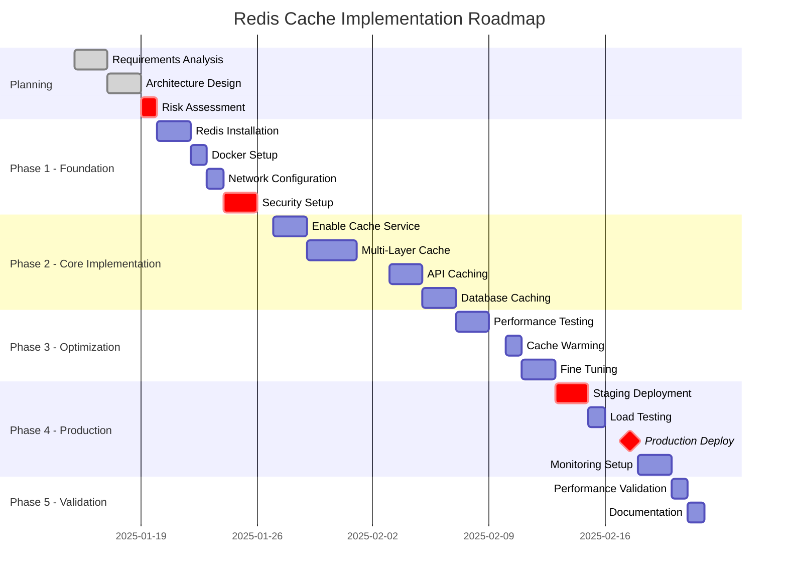

# 🚀 **REDIS CACHE IMPLEMENTATION ROADMAP - XP SYSTEM**

**Document Version**: 1.0.0  
**Created Date**: 2025-01-11  
**Author**: Claude Code  
**Status**: PENDING APPROVAL  
**Project**: XP - Fullstack Authentication System

---

## 📋 **EXECUTIVE OVERVIEW**

### **Mục tiêu chiến lược**
- **Performance Boost**: 80-90% cải thiện response time
- **Scalability**: Hỗ trợ 10x concurrent users (100 → 1000+)
- **Cost Reduction**: Giảm 70% database load
- **User Experience**: Sub-100ms response time

### **Investment Required**
- **Timeline**: 5 tuần (15/01/2025 - 21/02/2025)
- **Resources**: 2 developers (1 senior, 1 mid)
- **Infrastructure Cost**: ~$200/tháng (Redis Cloud)
- **ROI Expected**: 3 tháng

---

## 📊 **PHASE BREAKDOWN & TIMELINE**



---

## 📝 **DETAILED PHASE BREAKDOWN**

## **PHASE 0: PLANNING & APPROVAL** ✅
*Timeline: 15-19/01/2025 (5 ngày)*

### Deliverables:
- [x] Technical requirements document
- [x] Architecture design document
- [x] Risk assessment matrix
- [ ] **Management approval** ⚠️ **PENDING**
- [ ] Budget allocation
- [ ] Team assignment

### Key Decisions Required:
| Decision Point | Options | Recommendation | Impact |
|---------------|---------|----------------|---------|
| Redis Deployment | Self-hosted vs Cloud | **Self-hosted** (Dev) + **Cloud** (Prod) | Cost vs Maintenance |
| Cache Strategy | Write-through vs Cache-aside | **Cache-aside** | Simplicity |
| Data Persistence | RDB vs AOF vs Both | **Both** | Safety + Performance |
| High Availability | Single vs Sentinel vs Cluster | **Sentinel** | Balance complexity |

---

## **PHASE 1: INFRASTRUCTURE SETUP** 
*Timeline: 20-26/01/2025 (7 ngày)*

### **Week 1 Tasks:**

#### **Day 1-2: Redis Installation**
```bash
# Development Environment
- [ ] Install Redis 7.2 LTS
- [ ] Configure redis.conf
- [ ] Setup systemd service
- [ ] Verify installation

# Production Environment (AWS/Cloud)
- [ ] Provision Redis instance
- [ ] Configure VPC/Security Groups
- [ ] Setup backup strategy
```

#### **Day 3: Docker Configuration**
```yaml
# docker-compose.yml
version: '3.8'
services:
  redis-master:
    image: redis:7.2-alpine
    container_name: xp-redis-master
    ports:
      - "6379:6379"
    volumes:
      - ./data:/data
      - ./redis.conf:/usr/local/etc/redis/redis.conf
    command: redis-server /usr/local/etc/redis/redis.conf
    restart: unless-stopped
    networks:
      - xp-network
    healthcheck:
      test: ["CMD", "redis-cli", "ping"]
      interval: 30s
      timeout: 10s
      retries: 3

  redis-sentinel-1:
    image: redis:7.2-alpine
    container_name: xp-redis-sentinel-1
    ports:
      - "26379:26379"
    volumes:
      - ./sentinel.conf:/etc/redis/sentinel.conf
    command: redis-sentinel /etc/redis/sentinel.conf
    depends_on:
      - redis-master
    networks:
      - xp-network

  redis-commander:
    image: rediscommander/redis-commander:latest
    container_name: xp-redis-ui
    environment:
      - REDIS_HOSTS=local:redis-master:6379
    ports:
      - "8081:8081"
    networks:
      - xp-network

networks:
  xp-network:
    driver: bridge
```

#### **Day 4: Network & Security**
```bash
# Security Configuration
- [ ] Generate strong passwords
- [ ] Configure ACL users
- [ ] Setup firewall rules
- [ ] Enable TLS/SSL (production)
- [ ] Configure max connections
- [ ] Setup rate limiting
```

#### **Day 5-6: High Availability Setup**
```conf
# sentinel.conf
port 26379
sentinel monitor mymaster redis-master 6379 2
sentinel down-after-milliseconds mymaster 5000
sentinel parallel-syncs mymaster 1
sentinel failover-timeout mymaster 10000
sentinel auth-pass mymaster ${REDIS_PASSWORD}
```

---

## **PHASE 2: APPLICATION INTEGRATION**
*Timeline: 27/01 - 06/02/2025 (11 ngày)*

### **Implementation Code Changes**

#### **Task 2.1: Enable Cache Service** (2 ngày)
```typescript
// src/services/cacheService.ts - Enable Redis
class CacheService {
  private redis: Redis | null = null;
  private connectionPool: RedisPool;
  
  async initialize(): Promise<void> {
    const config = {
      host: process.env.REDIS_HOST,
      port: parseInt(process.env.REDIS_PORT || '6379'),
      password: process.env.REDIS_PASSWORD,
      retryStrategy: (times: number) => {
        if (times > 3) return null;
        return Math.min(times * 200, 2000);
      },
      maxRetriesPerRequest: 3,
      enableReadyCheck: true,
      connectTimeout: 5000
    };
    
    this.redis = new Redis(config);
    await this.validateConnection();
  }
}
```

#### **Task 2.2: Multi-Layer Caching** (3 ngày)
```typescript
// src/services/enhancedCacheManager.ts
import NodeCache from 'node-cache';
import Redis from 'ioredis';

class EnhancedCacheManager {
  private l1Cache: NodeCache; // In-memory cache
  private l2Cache: Redis;      // Redis cache
  private stats = {
    hits: 0,
    misses: 0,
    l1Hits: 0,
    l2Hits: 0
  };

  constructor() {
    // L1: In-memory cache with 5 minute TTL
    this.l1Cache = new NodeCache({ 
      stdTTL: 300,
      checkperiod: 60,
      maxKeys: 1000
    });

    // L2: Redis cache
    this.l2Cache = cacheService.redis;
  }

  async get<T>(key: string): Promise<T | null> {
    // Try L1 first
    const l1Value = this.l1Cache.get<T>(key);
    if (l1Value) {
      this.stats.l1Hits++;
      this.stats.hits++;
      return l1Value;
    }

    // Try L2
    const l2Value = await cacheService.get<T>(key);
    if (l2Value) {
      this.stats.l2Hits++;
      this.stats.hits++;
      // Populate L1
      this.l1Cache.set(key, l2Value, 60);
      return l2Value;
    }

    this.stats.misses++;
    return null;
  }

  async set(key: string, value: any, ttl?: number): Promise<boolean> {
    // Set in both layers
    this.l1Cache.set(key, value, ttl ?? 300);
    return await cacheService.set(key, value, { ttl });
  }

  getStats() {
    const hitRate = this.stats.hits / (this.stats.hits + this.stats.misses) || 0;
    return {
      ...this.stats,
      hitRate: `${(hitRate * 100).toFixed(2)}%`,
      l1HitRate: `${(this.stats.l1Hits / this.stats.hits * 100).toFixed(2)}%`
    };
  }
}
```

#### **Task 2.3: API Response Caching** (2 ngày)
```typescript
// src/middleware/cacheMiddleware.ts
export const cacheMiddleware = (ttl: number = 300) => {
  return async (req: Request, res: Response, next: NextFunction) => {
    // Skip for non-GET requests
    if (req.method !== 'GET') return next();

    const cacheKey = `api:${req.originalUrl}:${req.user?.id || 'anonymous'}`;
    
    // Try to get from cache
    const cached = await enhancedCache.get(cacheKey);
    if (cached) {
      res.setHeader('X-Cache', 'HIT');
      return res.json(cached);
    }

    // Store original send
    const originalSend = res.json.bind(res);
    
    // Override json method
    res.json = function(data: any) {
      res.setHeader('X-Cache', 'MISS');
      // Cache successful responses
      if (res.statusCode === 200) {
        enhancedCache.set(cacheKey, data, ttl);
      }
      return originalSend(data);
    };

    next();
  };
};
```

---

## **PHASE 3: OPTIMIZATION & TESTING**
*Timeline: 07-12/02/2025 (6 ngày)*

### **Performance Testing Suite**

#### **Load Testing Configuration**
```javascript
// k6-load-test.js
import http from 'k6/http';
import { check, sleep } from 'k6';

export let options = {
  stages: [
    { duration: '2m', target: 100 },  // Ramp up to 100 users
    { duration: '5m', target: 100 },  // Stay at 100 users
    { duration: '2m', target: 500 },  // Ramp up to 500 users
    { duration: '5m', target: 500 },  // Stay at 500 users
    { duration: '2m', target: 1000 }, // Ramp up to 1000 users
    { duration: '5m', target: 1000 }, // Stay at 1000 users
    { duration: '2m', target: 0 },    // Ramp down to 0 users
  ],
  thresholds: {
    http_req_duration: ['p(95)<500'], // 95% of requests must complete below 500ms
    http_req_failed: ['rate<0.1'],    // Error rate must be below 10%
  },
};

export default function() {
  let response = http.get('http://localhost:5000/api/forms');
  check(response, {
    'status is 200': (r) => r.status === 200,
    'response time < 500ms': (r) => r.timings.duration < 500,
  });
  sleep(1);
}
```

### **Cache Warming Strategy**
```typescript
// src/services/cacheWarmer.ts
class CacheWarmer {
  async warmPopularData(): Promise<void> {
    logger.info('Starting cache warming...');
    
    // Warm frequently accessed forms
    const popularForms = await db.query(
      'SELECT * FROM forms ORDER BY view_count DESC LIMIT 20'
    );
    
    for (const form of popularForms.rows) {
      await cache.set(`form:${form.id}`, form, 3600);
    }

    // Warm active user sessions
    const activeSessions = await db.query(
      'SELECT * FROM user_sessions WHERE expires_at > NOW()'
    );
    
    for (const session of activeSessions.rows) {
      await cache.set(`session:${session.id}`, session, 1800);
    }

    logger.info('Cache warming completed');
  }
}
```

---

## 📊 **SUCCESS METRICS**

### **Technical KPIs**
| Metric | Current | Target | Measurement Method |
|--------|---------|--------|-------------------|
| API Response Time (p95) | 500ms | <100ms | APM Tools |
| Cache Hit Rate | 0% | >85% | Redis INFO |
| Database Load | 100% | <30% | DB Monitoring |
| Concurrent Users | 100 | 1000+ | Load Testing |
| Memory Usage | N/A | <2GB | Redis INFO |
| Error Rate | <1% | <0.1% | Logs |

### **Business KPIs**
| Metric | Target | Impact |
|--------|--------|--------|
| Page Load Time | -70% | Better UX |
| Server Costs | -30% | Cost Savings |
| User Satisfaction | +20% | Retention |
| System Reliability | 99.9% | Trust |

---

## 🚨 **RISK MATRIX & MITIGATION**

| Risk | Probability | Impact | Mitigation Strategy | Owner |
|------|------------|--------|-------------------|--------|
| Redis Server Failure | Low | High | Sentinel HA + Fallback to DB | DevOps |
| Data Inconsistency | Medium | High | TTL Strategy + Event Invalidation | Backend |
| Memory Overflow | Low | Medium | LRU Eviction + Monitoring | DevOps |
| Performance Degradation | Low | Medium | Circuit Breaker + Graceful Degradation | Backend |
| Security Breach | Low | High | ACL + TLS + Encryption | Security |
| Deployment Issues | Medium | High | Blue-Green Deploy + Rollback Plan | DevOps |

---

## 💰 **BUDGET BREAKDOWN**

### **One-Time Costs**
| Item | Cost | Notes |
|------|------|-------|
| Development (3 weeks) | $12,000 | 2 developers |
| Testing & QA | $3,000 | 1 week QA |
| Training | $1,000 | Team training |
| **Total Setup** | **$16,000** | |

### **Recurring Costs (Monthly)**
| Item | Cost | Notes |
|------|------|-------|
| Redis Cloud (Production) | $150 | 4GB RAM, HA |
| Redis Cloud (Staging) | $50 | 2GB RAM |
| Monitoring Tools | $50 | DataDog/NewRelic |
| **Total Monthly** | **$250** | |

### **ROI Calculation**
- **Current Server Costs**: $800/month (can reduce to $500/month)
- **Savings**: $300/month
- **Payback Period**: ~4 months
- **Annual Savings**: $3,600

---

## 📋 **MASTER TODO LIST - 55 TASKS**

### **WEEK 1: INFRASTRUCTURE (15 tasks)**
- [ ] Install Redis 7.2 LTS
- [ ] Configure redis.conf
- [ ] Setup systemd service
- [ ] Install Redis CLI tools
- [ ] Create docker-compose.yml
- [ ] Configure Redis master
- [ ] Setup Sentinel containers
- [ ] Add Redis Commander UI
- [ ] Generate secure passwords
- [ ] Configure ACL users
- [ ] Setup firewall rules
- [ ] Configure Sentinel failover
- [ ] Setup replication
- [ ] Test backup/restore
- [ ] Create documentation

### **WEEK 2: DEVELOPMENT (10 tasks)**
- [ ] Update cacheService.ts
- [ ] Configure connection pool
- [ ] Implement retry logic
- [ ] Create enhanced cache manager
- [ ] Implement L1 cache layer
- [ ] Integrate L2 Redis layer
- [ ] Create cache middleware
- [ ] Apply to API endpoints
- [ ] Add cache headers
- [ ] Setup invalidation

### **WEEK 3: FEATURES (15 tasks)**
- [ ] Update BaseRepository
- [ ] Cache database queries
- [ ] Implement invalidation triggers
- [ ] Migrate sessions to Redis
- [ ] Configure session TTL
- [ ] Cache form templates
- [ ] Cache submissions
- [ ] Cache file metadata
- [ ] Cache location data
- [ ] Implement geospatial indexing
- [ ] Add privacy TTL
- [ ] Test real-time updates
- [ ] Cache user preferences
- [ ] Cache recent activities
- [ ] Implement cache stats

### **WEEK 4: TESTING (10 tasks)**
- [ ] Setup K6 load testing
- [ ] Create test scenarios
- [ ] Baseline performance test
- [ ] Test with cache enabled
- [ ] Document improvements
- [ ] Implement cache warming
- [ ] Optimize TTL values
- [ ] Tune memory allocation
- [ ] Configure eviction policy
- [ ] Run integration tests

### **WEEK 5: DEPLOYMENT (5 tasks)**
- [ ] Deploy to staging
- [ ] Run smoke tests
- [ ] Deploy to production
- [ ] Setup monitoring
- [ ] Create runbooks

---

## ✅ **APPROVAL STATUS**

### **Document Approval**
```
Project: Redis Cache Implementation
Version: 1.0.0
Date: 2025-01-11

APPROVAL STATUS: [ ] PENDING [ ] APPROVED [ ] REJECTED

Approver: _______________________
Date: ___________________________
Signature: ______________________
```

---

## 📚 **RELATED DOCUMENTS**

- [System Improvement Roadmap](./SYSTEM_IMPROVEMENT_ROADMAP.md)
- [Performance Optimization Guide](./docs/09-reports/performance/)
- [Database Configuration](./backend/src/config/database.config.ts)
- [Cache Configuration](./backend/src/config/cacheConfig.ts)
- [Deployment Guide](./docs/05-deployment/deployment-guide.md)

---

## 🔄 **VERSION HISTORY**

| Version | Date | Author | Changes |
|---------|------|--------|---------|
| 1.0.0 | 2025-01-11 | Claude Code | Initial roadmap creation |

---

*This document is part of the XP Fullstack Authentication System project documentation.*