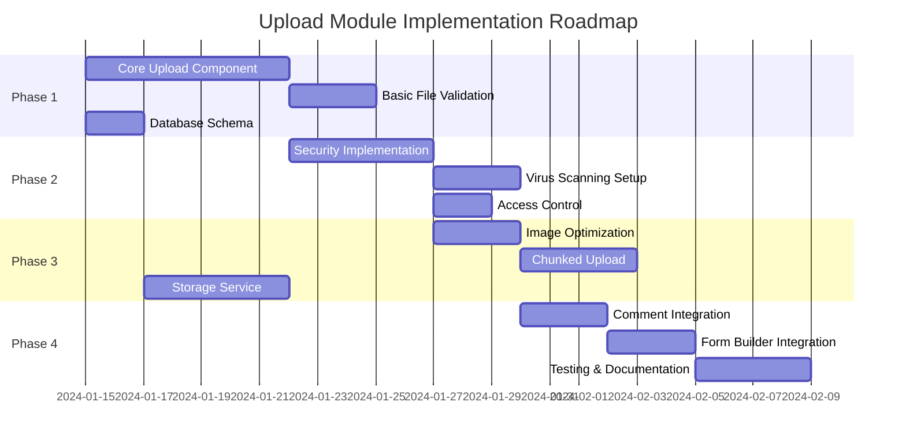

# 🚀 Upload Module - Roadmap & Implementation Checklist

## 📅 Timeline Overview
**Total Duration:** 4 tuần (28 ngày)
**Start Date:** _____________
**Target Completion:** _____________

---

## 📊 Roadmap Phases



---

## 🎯 Phase 1: Core Foundation (Week 1)
**Goal:** Basic upload functionality working end-to-end

### Day 1-2: Project Setup & Database

#### Backend Tasks
- [ ] Create database migrations for file storage
  ```sql
  -- migrations/001_create_files_table.sql
  CREATE TABLE files (
    id UUID PRIMARY KEY,
    original_name VARCHAR(255),
    stored_name VARCHAR(255),
    mime_type VARCHAR(100),
    size BIGINT,
    path TEXT,
    uploaded_by UUID,
    created_at TIMESTAMP
  );
  ```
  
- [ ] Setup storage directory structure
  ```bash
  mkdir -p storage/uploads/{2024,temp,thumbnails}
  mkdir -p storage/private
  ```

- [ ] Install backend dependencies
  ```bash
  npm install --save multer sharp uuid file-type-ext
  npm install --save-dev @types/multer @types/sharp
  ```

- [ ] Create storage configuration file
  - [ ] `/backend/src/config/storage.config.ts`
  - [ ] Environment variables in `.env`

#### Frontend Tasks
- [ ] Install frontend dependencies
  ```bash
  npm install --save react-dropzone axios
  npm install --save-dev @types/react-dropzone
  ```

- [ ] Create folder structure
  ```
  /frontend/src/components/upload/
  ├── FileUpload.tsx
  ├── FilePreview.tsx
  ├── UploadProgress.tsx
  └── index.ts
  ```

### Day 3-4: Basic Upload Component

#### Component Development
- [ ] Create `FileUpload.tsx` component
  - [ ] Drag & drop zone
  - [ ] File selection button
  - [ ] Multiple file support
  - [ ] Basic validation (size, type)

- [ ] Create `FilePreview.tsx` component
  - [ ] Thumbnail for images
  - [ ] Icon for other file types
  - [ ] File name and size display
  - [ ] Remove button

- [ ] Create `UploadProgress.tsx` component
  - [ ] Progress bar
  - [ ] Upload speed
  - [ ] Time remaining

#### API Development
- [ ] Create upload router `/backend/src/routes/upload.routes.ts`
  - [ ] POST `/api/upload/single`
  - [ ] POST `/api/upload/multiple`
  - [ ] GET `/api/upload/:id`
  - [ ] DELETE `/api/upload/:id`

- [ ] Create upload controller
  - [ ] File validation
  - [ ] Save to disk
  - [ ] Database entry
  - [ ] Response formatting

### Day 5-6: File Management

#### Backend Services
- [ ] Create `FileService.ts`
  ```typescript
  class FileService {
    - saveFile(file: Express.Multer.File)
    - getFile(fileId: string)
    - deleteFile(fileId: string)
    - generateThumbnail(file: File)
  }
  ```

- [ ] Create `StorageService.ts`
  ```typescript
  class StorageService {
    - store(file: Buffer, path: string)
    - retrieve(path: string)
    - delete(path: string)
    - exists(path: string)
  }
  ```

#### Frontend Integration
- [ ] Create upload service `/frontend/src/services/uploadService.ts`
- [ ] Integrate with FileUpload component
- [ ] Add error handling
- [ ] Add success notifications

### Day 7: Basic Testing

#### Test Coverage
- [ ] Unit tests for validation functions
- [ ] Component rendering tests
- [ ] API endpoint tests
- [ ] File upload flow E2E test

---

## 🔒 Phase 2: Security & Validation (Week 2)
**Goal:** Secure file upload with comprehensive validation

### Day 8-9: Advanced Validation

#### Validation Implementation
- [ ] MIME type validation
  ```typescript
  const ALLOWED_TYPES = [
    'image/jpeg', 'image/png', 'image/gif',
    'application/pdf', 'text/plain'
  ];
  ```

- [ ] File extension validation
- [ ] Magic number validation (file header check)
- [ ] File size limits by type
- [ ] Filename sanitization
  ```typescript
  filename.replace(/[^a-z0-9.-]/gi, '_').toLowerCase()
  ```

#### Security Headers
- [ ] Content-Security-Policy
- [ ] X-Content-Type-Options
- [ ] X-Frame-Options

### ~~Day 10-11: Virus Scanning~~ (SKIPPED - Not Required)

#### ~~ClamAV Setup~~
- ~~Install ClamAV~~
- ~~Install Node.js ClamAV client~~
- ~~Create virus scanning service~~
- ~~Integrate with upload flow~~
- ~~Quarantine infected files~~
- ~~Log security events~~

**Note:** Virus scanning has been removed from requirements. Focus on other security measures like file validation and access control.

### Day 12: Access Control

#### Permission System
- [ ] File ownership tracking
- [ ] Public/Private file flags
- [ ] User permission checks
- [ ] Signed URL generation for private files

#### Rate Limiting
- [ ] Implement upload rate limiting
  ```typescript
  const uploadLimiter = rateLimit({
    windowMs: 15 * 60 * 1000, // 15 minutes
    max: 10, // 10 uploads per window
    message: 'Too many uploads'
  });
  ```

- [ ] File size quota per user
- [ ] Bandwidth tracking

### Day 13-14: Audit & Logging

#### Audit System
- [ ] Create `file_access_logs` table
- [ ] Log all file operations
- [ ] Track download counts
- [ ] Monitor suspicious activity

---

## ⚡ Phase 3: Optimization & Features (Week 3)
**Goal:** Performance optimization and advanced features

### Day 15-16: Image Processing

#### Image Optimization
- [ ] Automatic image resizing
  ```typescript
  const sizes = {
    thumbnail: { width: 150, height: 150 },
    small: { width: 320, height: 240 },
    medium: { width: 800, height: 600 },
    large: { width: 1920, height: 1080 }
  };
  ```

- [ ] WebP conversion for browsers that support it
- [ ] JPEG quality optimization
- [ ] PNG compression
- [ ] EXIF data removal (privacy)

#### Thumbnail Generation
- [ ] Generate thumbnails on upload
- [ ] Lazy thumbnail generation
- [ ] Cache thumbnails
- [ ] Serve optimized versions based on device

### Day 17-18: Chunked Upload

#### Large File Support
- [ ] Implement chunked upload endpoint
  ```typescript
  POST /api/upload/chunk
  {
    uploadId: string,
    chunkIndex: number,
    totalChunks: number,
    chunk: Binary
  }
  ```

- [ ] Create `file_chunks` table
- [ ] Chunk assembly service
- [ ] Resume capability for interrupted uploads
- [ ] Progress tracking per chunk

### Day 19-20: Storage Optimization

#### Storage Strategy
- [ ] Implement storage tiers
  - [ ] Hot storage (frequently accessed)
  - [ ] Cold storage (archive)
  - [ ] Temporary storage (auto-cleanup)

- [ ] File compression for text files
- [ ] Duplicate detection (hash comparison)
- [ ] Automatic cleanup job
  ```typescript
  // Cron job: Clean temp files older than 24h
  @Cron('0 0 * * *')
  async cleanupTempFiles() {
    await this.storageService.cleanTempFiles(24);
  }
  ```

### ~~Day 21: CDN Integration~~ (SKIPPED - Not Required)

#### ~~CDN Setup~~
- ~~CloudFlare integration~~
- ~~Cache headers configuration~~
- ~~Purge cache on file update~~
- ~~Fallback to origin on CDN failure~~

**Note:** CDN integration has been removed from requirements. Focus on optimizing local storage and caching strategies.

---

## 🔗 Phase 4: Integration & Polish (Week 4)
**Goal:** Integrate with existing features and finalize

### Day 22-23: Comment Integration

#### Comment Attachments
- [ ] Add file upload to CommentPanel
  ```tsx
  <CommentPanel>
    <FileUpload
      context="comment"
      entityId={commentId}
      maxFiles={3}
      maxSize={5 * 1024 * 1024}
    />
  </CommentPanel>
  ```

- [ ] Update comment model to support attachments
- [ ] Display attached files in comments
- [ ] Download attachments from comments
- [ ] Delete attachments with comments

### Day 24-25: Form Builder Integration

#### File Upload Field Type
- [ ] Create FileUploadField component
- [ ] Add to form builder field types
  ```typescript
  {
    type: 'file',
    icon: 'paperclip',
    label: 'File Upload',
    configOptions: {
      multiple: boolean,
      maxFiles: number,
      maxSize: number,
      allowedTypes: string[]
    }
  }
  ```

- [ ] Validation rules for file fields
- [ ] Save file references with form submission
- [ ] Display files in submission view

### Day 26-27: Testing & Bug Fixes

#### Comprehensive Testing
- [ ] Unit tests (>80% coverage)
  - [ ] Validation logic
  - [ ] Service methods
  - [ ] API endpoints

- [ ] Integration tests
  - [ ] Upload flow
  - [ ] Virus scanning
  - [ ] Access control

- [ ] E2E tests
  - [ ] Comment with attachment
  - [ ] Form submission with files
  - [ ] File management

- [ ] Performance testing
  - [ ] Large file upload
  - [ ] Multiple concurrent uploads
  - [ ] Load testing

#### Bug Fixes & Polish
- [ ] Fix identified bugs
- [ ] UI/UX improvements
- [ ] Error message improvements
- [ ] Loading states
- [ ] Accessibility improvements

### Day 28: Documentation & Deployment

#### Documentation
- [ ] API documentation
- [ ] Component documentation
- [ ] Integration guide
- [ ] Security guidelines
- [ ] Troubleshooting guide

#### Deployment Preparation
- [ ] Production environment config
- [ ] Backup strategy
- [ ] Monitoring setup
- [ ] Performance benchmarks
- [ ] Rollback plan

---

## 📋 Daily Checklist Template

### Daily Developer Checklist
```markdown
## Date: ___________

### Morning (9:00 - 12:00)
- [ ] Review today's tasks
- [ ] Check dependencies/blockers
- [ ] Update progress in project tracker
- [ ] Core development tasks

### Afternoon (13:00 - 17:00)
- [ ] Continue development
- [ ] Write/update tests
- [ ] Code review if needed
- [ ] Update documentation

### End of Day (17:00 - 18:00)
- [ ] Commit code with clear message
- [ ] Update task status
- [ ] Note blockers for tomorrow
- [ ] Quick test of today's work

### Completed Today:
1. ________________________
2. ________________________
3. ________________________

### Blockers:
- ________________________

### Tomorrow's Priority:
- ________________________
```

---

## 🎯 Success Metrics

### Phase 1 Success Criteria
- [ ] Files can be uploaded and stored
- [ ] Basic validation works
- [ ] Files are saved to database
- [ ] Can retrieve uploaded files

### Phase 2 Success Criteria
- [ ] All file types validated properly
- ~~Virus scanning operational~~ (SKIPPED)
- [ ] Access control enforced
- [ ] Security headers configured

### Phase 3 Success Criteria
- [ ] Images optimized automatically
- [ ] Large files upload successfully
- [ ] Storage organized efficiently
- [ ] Performance targets met

### Phase 4 Success Criteria
- [ ] Comments support attachments
- [ ] Form builder has file field
- [ ] All tests passing
- [ ] Documentation complete

---

## 🚨 Risk Mitigation

### Potential Risks & Solutions

| Risk | Impact | Mitigation |
|------|--------|------------|
| ClamAV setup fails | High | Use alternative: node-virustotal API |
| Storage fills up | High | Implement quotas & cleanup jobs |
| Large files timeout | Medium | Implement chunked upload early |
| Performance issues | Medium | Add caching layer, optimize images |
| Security vulnerabilities | High | Regular security audits, pen testing |

---

## 📊 Progress Tracking

### Week 1 Progress: ▓▓▓▓▓▓▓░░░░░░░ 0%
### Week 2 Progress: ░░░░░░░░░░░░░░ 0%
### Week 3 Progress: ░░░░░░░░░░░░░░ 0%
### Week 4 Progress: ░░░░░░░░░░░░░░ 0%

**Overall Progress:** 0/28 days (0%)

---

## 🛠️ Tools & Resources

### Development Tools
- **VS Code Extensions:** Thunder Client, SQLite Viewer
- **Testing:** Jest, React Testing Library, Cypress
- **Monitoring:** PM2, Winston Logger
- **Security:** OWASP ZAP, npm audit

### Useful Resources
- [Multer Documentation](https://github.com/expressjs/multer)
- [Sharp.js Guide](https://sharp.pixelplumbing.com/)
- [ClamAV Setup](https://www.clamav.net/documents)
- [Security Best Practices](https://owasp.org/www-project-web-security-testing-guide/)

---

## 📝 Notes Section

### Implementation Notes:
_____________________________________
_____________________________________
_____________________________________

### Decisions Made:
_____________________________________
_____________________________________
_____________________________________

### Lessons Learned:
_____________________________________
_____________________________________
_____________________________________