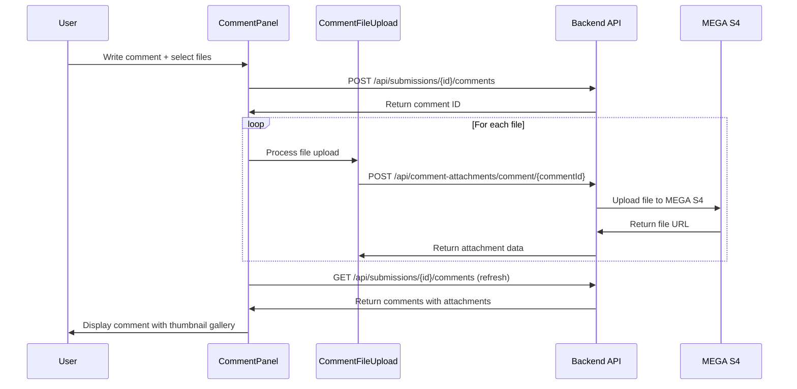

# 📎 Comment File Attachment System

## 📋 Overview

The Comment File Attachment System allows users to upload multiple files with their comments, providing rich content sharing capabilities within the XP project's comment system.

**Implementation Date:** January 2025  
**Status:** ✅ Production Ready  
**Integration:** Full integration with existing comment system

---

## 🚀 Key Features

### ✅ Multiple File Upload
- **Max files per comment:** 5 files
- **Max file size:** 10MB per file
- **Supported formats:** All file types (images, documents, PDFs, etc.)
- **Upload method:** Drag & drop or click to select

### ✅ Storage Integration
- **Storage Provider:** MEGA S4 (AWS S3-compatible)
- **Endpoint:** `https://s3.eu-central-1.s4.mega.io`
- **Security:** Secure file keys with UUID generation
- **Lifecycle:** Soft delete support

### ✅ Visual Display
- **Gallery Style:** Horizontal scrollable thumbnail gallery
- **File Type Icons:** Automatic detection with appropriate icons
  - 🖼️ Images: Live thumbnail preview
  - 📄 PDFs: Red PDF icon
  - 📝 Documents: Blue DOC icon  
  - 📊 Spreadsheets: Green XLS icon
  - 📁 Others: Generic file icon

### ✅ User Experience
- **Download:** Direct file download by clicking thumbnails
- **File Info:** File name and size display
- **Error Handling:** Graceful fallback for failed image loads
- **Responsive:** Mobile-friendly horizontal scroll

---

## 🏗️ Architecture

### Database Schema

```sql
-- Comment Attachments Table
CREATE TABLE comment_attachments (
    id UUID PRIMARY KEY DEFAULT gen_random_uuid(),
    comment_id UUID NOT NULL REFERENCES submission_comments(id) ON DELETE CASCADE,
    original_name VARCHAR(255) NOT NULL,
    mime_type VARCHAR(100) NOT NULL,
    file_size BIGINT NOT NULL,
    file_key VARCHAR(255) NOT NULL UNIQUE,
    created_at TIMESTAMP DEFAULT CURRENT_TIMESTAMP,
    deleted_at TIMESTAMP NULL
);

-- Indexes for performance
CREATE INDEX idx_comment_attachments_comment_id ON comment_attachments(comment_id);
CREATE INDEX idx_comment_attachments_file_key ON comment_attachments(file_key);
CREATE INDEX idx_comment_attachments_deleted_at ON comment_attachments(deleted_at) WHERE deleted_at IS NULL;
```

### File Upload Workflow



---

## 🛠️ Implementation Details

### Frontend Components

#### CommentFileUpload Component
**Location:** `/frontend/src/components/upload/CommentFileUpload.tsx`

```typescript
interface CommentFileUploadProps {
  onFilesSelected: (files: File[]) => void;
  uploadedFiles: FileAttachment[];
  maxFiles?: number;
  maxSize?: number;
  disabled?: boolean;
}
```

**Key Features:**
- Drag and drop file selection
- File type and size validation
- Progress indicators during upload
- File preview with remove capability

#### Enhanced CommentPanel
**Location:** `/frontend/src/components/comments/CommentPanel.tsx`

**New Features:**
- File upload integration in comment form
- Horizontal thumbnail gallery display
- File download functionality
- Attachment count indicators

### Backend Implementation

#### File Upload API
**Endpoint:** `POST /api/comment-attachments/comment/:commentId`

```typescript
// Request: multipart/form-data with 'file' field
// Response:
{
  "success": true,
  "data": {
    "id": "uuid",
    "original_name": "document.pdf",
    "mime_type": "application/pdf",
    "file_size": 1024000,
    "file_key": "unique-key",
    "url": "/api/comment-attachments/uuid/download"
  }
}
```

#### File Download API
**Endpoint:** `GET /api/comment-attachments/:id/download`

- Secure file access with attachment ID
- Proper content-type headers
- Direct streaming from MEGA S4
- Download analytics (future enhancement)

#### Enhanced Comment Queries
**SQL with Attachment Aggregation:**

```sql
SELECT 
  sc.*,
  u.avatar_url,
  COALESCE(
    JSON_AGG(
      CASE WHEN ca.id IS NOT NULL THEN
        JSON_BUILD_OBJECT(
          'id', ca.id,
          'original_name', ca.original_name,
          'mime_type', ca.mime_type,
          'file_size', ca.file_size,
          'file_key', ca.file_key,
          'url', '/api/comment-attachments/' || ca.id || '/download'
        )
      ELSE NULL END
    ) FILTER (WHERE ca.id IS NOT NULL), 
    '[]'::json
  ) as attachments
FROM submission_comments sc
LEFT JOIN users u ON sc.user_id = u.id
LEFT JOIN comment_attachments ca ON sc.id = ca.comment_id 
  AND ca.deleted_at IS NULL
WHERE sc.submission_id = $1
GROUP BY sc.id, u.avatar_url
ORDER BY sc.created_at ASC
```

---

## 🎨 User Interface

### File Upload Interface

```jsx
// Comment form with file upload
<div className="space-y-2">
  <textarea
    value={newComment}
    onChange={(e) => setNewComment(e.target.value)}
    placeholder="Write a comment..."
    className="w-full p-2 border border-gray-300 rounded-md"
    rows={2}
  />
  
  {/* File Upload Component */}
  <CommentFileUpload
    onFilesSelected={setCommentFiles}
    uploadedFiles={[]}
    maxFiles={5}
    maxSize={10 * 1024 * 1024} // 10MB
    disabled={uploadingFiles}
  />
  
  <button
    onClick={handleSubmitComment}
    disabled={(!newComment.trim() && commentFiles.length === 0) || uploadingFiles}
    className="px-4 py-2 bg-blue-600 text-white rounded-md hover:bg-blue-700 disabled:bg-gray-300"
  >
    {uploadingFiles ? (
      <><span className="animate-spin">⏳</span> Uploading...</>
    ) : (
      <><Paperclip className="w-4 h-4" /> Post Comment</>
    )}
  </button>
</div>
```

### Attachment Display Gallery

```jsx
// Horizontal scrollable thumbnail gallery
{comment.attachments && comment.attachments.length > 0 && (
  <div className="mt-3">
    <div className="text-xs text-gray-500 mb-2 font-medium">
      📎 {comment.attachments.length} tệp đính kèm
    </div>
    <div className="flex gap-2 overflow-x-auto pb-2" style={{
      scrollbarWidth: 'thin',
      scrollbarColor: '#CBD5E0 #F7FAFC'
    }}>
      {comment.attachments.map((attachment) => (
        <div
          key={attachment.id}
          className="flex-shrink-0 group cursor-pointer"
          onClick={() => window.open(attachment.url, '_blank')}
        >
          <div className="w-20 h-20 bg-gray-50 border border-gray-200 rounded-lg p-1 hover:border-blue-300 hover:bg-blue-50 hover:shadow-md transition-all duration-200">
            {/* File type specific display */}
            {attachment.mime_type.startsWith('image/') ? (
              
            ) : (
              <div className="w-full h-full flex flex-col items-center justify-center">
                <FileIcon className="w-6 h-6 text-blue-500 mb-1" />
                <div className="text-[10px] text-center text-gray-600">
                  {getFileTypeLabel(attachment.mime_type)}
                </div>
              </div>
            )}
          </div>
          <div className="mt-1 w-20">
            <div className="text-[10px] text-gray-700 truncate text-center">
              {truncateFileName(attachment.original_name, 12)}
            </div>
            <div className="text-[9px] text-gray-500 text-center">
              {formatFileSize(attachment.file_size)}
            </div>
          </div>
        </div>
      ))}
    </div>
  </div>
)}
```

---

## 🔒 Security Features

### File Upload Security
- **File size validation:** 10MB limit per file
- **File count limit:** 5 files per comment
- **MIME type detection:** Server-side validation
- **Unique file keys:** UUID-based file storage
- **Access control:** Comment-based permissions

### Storage Security
- **MEGA S4 integration:** Enterprise-grade security
- **Encrypted transmission:** HTTPS for all uploads
- **Access logging:** File access tracking (ready for implementation)
- **Soft delete:** Reversible file deletion

---

## 📊 Performance Considerations

### Frontend Performance
- **Lazy loading:** Thumbnails load on demand
- **Image optimization:** Automatic image compression
- **Horizontal scrolling:** Efficient rendering for many attachments
- **Fallback handling:** Graceful degradation for failed loads

### Backend Performance  
- **Streaming uploads:** Direct to MEGA S4 without local storage
- **Database indexing:** Optimized queries for attachment retrieval
- **JSON aggregation:** Single query for comments with attachments
- **Connection pooling:** Efficient database connections

### Storage Performance
- **CDN integration:** MEGA S4 global distribution
- **Caching headers:** Browser caching for file downloads
- **Parallel uploads:** Multiple files upload simultaneously

---

## 📝 Usage Examples

### Basic File Upload
```typescript
// User selects files and writes comment
const handleSubmitComment = async () => {
  // Step 1: Create comment
  const commentResponse = await apiService.post(
    `/api/submissions/${submissionId}/comments`,
    { content: newComment || 'File attachment' }
  );
  
  // Step 2: Upload files
  if (commentFiles.length > 0) {
    const uploadPromises = commentFiles.map(file => {
      const formData = new FormData();
      formData.append('file', file);
      
      return apiService.post(
        `/api/comment-attachments/comment/${commentResponse.data.comment.id}`,
        formData,
        { headers: { 'Content-Type': 'multipart/form-data' } }
      );
    });
    
    await Promise.all(uploadPromises);
  }
  
  // Step 3: Refresh comments to show attachments
  fetchComments();
};
```

### File Download
```typescript
// Direct download from attachment gallery
const handleFileDownload = (attachment: FileAttachment) => {
  // Opens file in new tab for viewing/download
  window.open(attachment.url || `/api/comment-attachments/${attachment.id}/download`, '_blank');
};
```

---

## 🧪 Testing

### Manual Testing Checklist
- [x] Upload single file to comment
- [x] Upload multiple files (up to 5)
- [x] File size validation (reject >10MB)
- [x] File type detection and icon display
- [x] Image thumbnail preview
- [x] File download functionality
- [x] Attachment count display
- [x] Gallery horizontal scrolling
- [x] Mobile responsive behavior
- [x] Error handling for upload failures

### Automated Testing (Future)
- [ ] Unit tests for file validation
- [ ] Integration tests for upload workflow
- [ ] E2E tests for complete user journey
- [ ] Performance tests for large file handling

---

## 🔧 Configuration

### Environment Variables
```env
# MEGA S4 Configuration
MEGA_S4_ACCESS_KEY=your_access_key
MEGA_S4_SECRET_KEY=your_secret_key
MEGA_S4_BUCKET=your_bucket_name
MEGA_S4_REGION=eu-central-1
MEGA_S4_ENDPOINT=https://s3.eu-central-1.s4.mega.io

# File Upload Limits
MAX_FILE_SIZE=10485760  # 10MB in bytes
MAX_FILES_PER_COMMENT=5
ALLOWED_MIME_TYPES=*  # All types allowed
```

### Frontend Configuration
```typescript
// File upload limits
const MAX_FILE_SIZE = 10 * 1024 * 1024; // 10MB
const MAX_FILES = 5;

// Supported file type icons
const FILE_TYPE_ICONS = {
  'application/pdf': { icon: FileText, color: 'text-red-500', label: 'PDF' },
  'application/msword': { icon: FileText, color: 'text-blue-600', label: 'DOC' },
  'application/vnd.ms-excel': { icon: FileText, color: 'text-green-600', label: 'XLS' },
  // ... more types
};
```

---

## 🛠️ Maintenance & Monitoring

### Regular Tasks
- **Storage cleanup:** Remove soft-deleted files after 30 days
- **Orphaned files:** Clean up files without associated comments
- **Usage monitoring:** Track upload patterns and storage usage
- **Performance monitoring:** File upload success rates and times

### Health Checks
- **MEGA S4 connectivity:** Regular connection tests
- **File integrity:** Periodic file accessibility validation
- **Database consistency:** Comment-attachment relationship validation
- **Storage quotas:** Monitor bucket usage and limits

### Troubleshooting
```bash
# Check file upload service status
curl -X GET http://localhost:5000/health

# Test MEGA S4 connection
curl -X GET http://localhost:5000/api/comment-attachments/health

# View recent upload logs
tail -f /var/log/xp-backend/file-uploads.log
```

---

## 🏁 Conclusion

The Comment File Attachment System successfully extends the XP project's comment functionality with:

- ✅ **Multiple file upload capability** with intuitive drag & drop interface
- ✅ **Secure MEGA S4 storage integration** with enterprise-grade security
- ✅ **Visual thumbnail gallery** with responsive horizontal scrolling
- ✅ **Complete file management** with download and soft-delete capabilities
- ✅ **Production-ready implementation** with error handling and performance optimization

**Status: PRODUCTION READY** 🚀

---

## 📞 Support

For issues or questions:
- Review file upload logs in backend console
- Check MEGA S4 connection settings
- Verify database schema and indexes
- Test with example files in comment system

---

*Document Version: 1.0.0*  
*Last Updated: January 11, 2025*  
*Author: Claude Code Assistant*