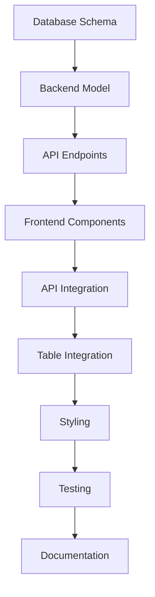

# 🚀 Comment Component Implementation Workflow

## 📋 Executive Summary
Triển khai hệ thống Comment đơn giản cho Table View, không có real-time collaboration, tập trung vào CRUD operations và nested replies.

**Thời gian ước tính:** 19 giờ (2-3 ngày)
**Độ phức tạp:** Medium
**Priority:** High

---

## 📊 Implementation Phases

### Phase 1: Database & Backend Foundation (6 giờ)
**Mục tiêu:** Thiết lập database schema và API endpoints

#### 1.1 Database Setup (2 giờ)
```sql
-- Priority: HIGH
-- Owner: Backend Developer
-- Dependencies: PostgreSQL database access

Tasks:
□ Create migration file for comments table
□ Add indexes for performance optimization
□ Setup soft delete mechanism
□ Test database queries performance
□ Document schema changes
```

**Files to create:**
- `/backend/src/migrations/001_create_comments_table.sql`
- `/backend/src/models/Comment.model.ts`

#### 1.2 Backend Model & Service (2 giờ)
```typescript
// Priority: HIGH
// Owner: Backend Developer
// Dependencies: Database schema completed

Tasks:
□ Implement Comment model with Sequelize/TypeORM
□ Create CommentService with business logic
□ Add validation rules (content length, depth limit)
□ Implement nested reply logic (max 3 levels)
□ Add user permission checks
```

**Files to create:**
- `/backend/src/modules/comments/comment.model.ts`
- `/backend/src/modules/comments/comment.service.ts`
- `/backend/src/modules/comments/comment.validation.ts`

#### 1.3 REST API Endpoints (2 giờ)
```typescript
// Priority: HIGH  
// Owner: Backend Developer
// Dependencies: Model & Service completed

Tasks:
□ GET /api/submissions/:id/comments - List comments
□ POST /api/submissions/:id/comments - Create comment
□ PUT /api/comments/:id - Update comment
□ DELETE /api/comments/:id - Soft delete comment
□ GET /api/submissions/:id/comments/count - Get count
□ Add authentication middleware
□ Add error handling
□ Write API documentation
```

**Files to create:**
- `/backend/src/modules/comments/comment.controller.ts`
- `/backend/src/modules/comments/comment.routes.ts`

---

### Phase 2: Frontend Components (6 giờ)
**Mục tiêu:** Build React components cho comment system

#### 2.1 Core Components Structure (2 giờ)
```typescript
// Priority: HIGH
// Owner: Frontend Developer
// Dependencies: API endpoints ready

Tasks:
□ Create CommentButton component (hiển thị count)
□ Create CommentPanel component (container chính)
□ Create CommentList component (danh sách comments)
□ Setup component props và TypeScript interfaces
□ Add loading states
□ Add error boundaries
```

**Files to create:**
- `/frontend/src/components/comments/CommentButton.tsx`
- `/frontend/src/components/comments/CommentPanel.tsx`
- `/frontend/src/components/comments/CommentList.tsx`
- `/frontend/src/types/comment.types.ts`

#### 2.2 Comment Item & Form (2 giờ)
```typescript
// Priority: HIGH
// Owner: Frontend Developer  
// Dependencies: Core components ready

Tasks:
□ Create CommentItem component với nested replies
□ Create CommentForm component (add/edit/reply)
□ Implement edit mode toggle
□ Add delete confirmation dialog
□ Handle reply threading (indent visualization)
□ Add timestamp formatting
```

**Files to create:**
- `/frontend/src/components/comments/CommentItem.tsx`
- `/frontend/src/components/comments/CommentForm.tsx`
- `/frontend/src/components/comments/CommentActions.tsx`

#### 2.3 API Integration & State Management (2 giờ)
```typescript
// Priority: HIGH
// Owner: Frontend Developer
// Dependencies: Components ready

Tasks:
□ Create comment API service layer
□ Implement React Query hooks for data fetching
□ Add optimistic updates for better UX
□ Handle loading và error states
□ Add refresh functionality
□ Implement local caching strategy
```

**Files to create:**
- `/frontend/src/services/commentService.ts`
- `/frontend/src/hooks/useComments.ts`
- `/frontend/src/hooks/useCommentMutations.ts`

---

### Phase 3: Integration & Polish (4 giờ)
**Mục tiêu:** Integrate với Table View và optimize UX

#### 3.1 Table View Integration (2 giờ)
```typescript
// Priority: HIGH
// Owner: Full-stack Developer
// Dependencies: All components ready

Tasks:
□ Add CommentButton to each table row
□ Position CommentPanel as slide-out drawer
□ Handle panel open/close animations
□ Manage focus và keyboard navigation
□ Update table row hover states
□ Test với different screen sizes
```

**Files to modify:**
- `/frontend/src/pages/DataTableView.tsx`
- `/frontend/src/components/table/TableContent.tsx`

#### 3.2 Styling & UX Polish (2 giờ)
```css
// Priority: MEDIUM
// Owner: Frontend Developer
// Dependencies: Integration complete

Tasks:
□ Style comment panel (slide-out animation)
□ Style comment items (avatar, content, actions)
□ Style nested replies (indentation, threading)
□ Add hover effects và transitions
□ Ensure mobile responsiveness
□ Dark mode support (if applicable)
```

**Files to create:**
- `/frontend/src/components/comments/Comments.module.css`
- `/frontend/src/components/comments/Comments.css`

---

### Phase 4: Testing & Documentation (3 giờ)
**Mục tiêu:** Ensure quality và maintainability

#### 4.1 Testing (2 giờ)
```typescript
// Priority: HIGH
// Owner: QA Engineer
// Dependencies: All features complete

Tasks:
□ Write unit tests for CommentService
□ Write API integration tests
□ Write React component tests
□ Test nested reply limits (max 3 levels)
□ Test permissions (edit/delete own comments)
□ Test edge cases (empty, long content)
□ Performance testing với nhiều comments
```

**Files to create:**
- `/backend/src/modules/comments/__tests__/comment.service.test.ts`
- `/backend/src/modules/comments/__tests__/comment.controller.test.ts`
- `/frontend/src/components/comments/__tests__/CommentPanel.test.tsx`

#### 4.2 Documentation (1 giờ)
```markdown
// Priority: MEDIUM
// Owner: Technical Writer
// Dependencies: Testing complete

Tasks:
□ Write user guide for comment feature
□ Document API endpoints với examples
□ Add JSDoc comments to components
□ Create troubleshooting guide
□ Update README với new feature
```

**Files to create/update:**
- `/docs/user-guide/comments.md`
- `/docs/api/comments-api.md`
- `/README.md`

---

## 🔄 Execution Order & Dependencies



## ⚡ Parallel Work Opportunities

**Can be done in parallel:**
- Database schema & Frontend component structure
- API documentation & Component styling
- Unit tests & Integration tests

**Must be sequential:**
- Database → Model → API
- Components → Integration → Table View
- All features → Testing → Documentation

---

## 🎯 Success Criteria

### Functional Requirements
✅ Users can add comments to any table row
✅ Users can reply to comments (max 3 levels)
✅ Users can edit their own comments
✅ Users can delete their own comments
✅ Comment count visible on each row
✅ Comments load in slide-out panel
✅ Proper error handling và loading states

### Performance Requirements
✅ Comments load within 2 seconds
✅ Panel animation smooth (60 fps)
✅ Support 100+ comments per submission
✅ Efficient nested query (single database call)

### Quality Requirements
✅ 80% test coverage
✅ No console errors
✅ Accessible (keyboard navigation)
✅ Mobile responsive
✅ Clean, maintainable code

---

## 🚨 Risk Mitigation

| Risk | Impact | Mitigation |
|------|--------|------------|
| Database performance với nested queries | High | Use recursive CTE, add proper indexes |
| Complex state management | Medium | Use React Query for caching |
| UI performance với many comments | Medium | Implement virtual scrolling if >100 |
| Permission bugs | High | Thorough testing of edit/delete |

---

## 📝 Implementation Checklist

### Day 1 (Backend Focus)
- [ ] Morning: Database schema và migrations
- [ ] Afternoon: Models và services
- [ ] Evening: API endpoints và testing

### Day 2 (Frontend Focus)
- [ ] Morning: Core components
- [ ] Afternoon: Forms và interactions
- [ ] Evening: API integration

### Day 3 (Integration & Polish)
- [ ] Morning: Table View integration
- [ ] Afternoon: Styling và UX
- [ ] Evening: Testing và documentation

---

## 🛠️ Tools & Technologies

**Backend:**
- Node.js + Express
- PostgreSQL
- Sequelize ORM
- Jest for testing

**Frontend:**
- React 18.3
- TypeScript
- React Query
- CSS Modules
- React Testing Library

**Development:**
- VS Code
- Postman (API testing)
- Chrome DevTools
- GitHub for version control

---

## 📊 Progress Tracking

Use this template to track progress:

```markdown
## Comment System Implementation Progress

### Phase 1: Backend (6h)
- [x] Database schema (2h) - DONE
- [ ] Models & Services (2h) - IN PROGRESS
- [ ] API Endpoints (2h) - PENDING

### Phase 2: Frontend (6h)
- [ ] Core Components (2h) - PENDING
- [ ] Forms & Items (2h) - PENDING
- [ ] API Integration (2h) - PENDING

### Phase 3: Integration (4h)
- [ ] Table Integration (2h) - PENDING
- [ ] Styling (2h) - PENDING

### Phase 4: Testing (3h)
- [ ] Unit Tests (1h) - PENDING
- [ ] Integration Tests (1h) - PENDING
- [ ] Documentation (1h) - PENDING

**Overall Progress: 10%**
```

---

## 🎯 Next Steps

1. **Immediate Action:** Create database migration file
2. **Team Assignment:** Assign backend và frontend developers
3. **Environment Setup:** Ensure dev database is ready
4. **Code Review:** Schedule review sessions after each phase
5. **Testing Plan:** Prepare test scenarios và data

---

## 📞 Support & Resources

- **Technical Lead:** Review architecture decisions
- **Database Admin:** Assist with migration và indexing
- **UX Designer:** Review panel design và interactions
- **QA Team:** Prepare test cases và scenarios
- **DevOps:** Setup CI/CD for new components