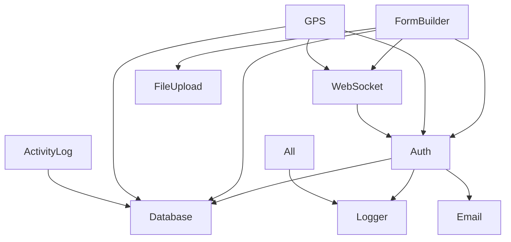

# Module Deep Dive Documentation - XP Project

## 🔐 Authentication Module

### Overview
JWT-based authentication with email verification, password reset, and session management.

### Core Components

#### AuthService (`backend/src/services/authService.ts`)
```typescript
// Key Methods:
- register(userData): Creates user with email verification
- login(credentials): Returns JWT + session
- logout(token): Invalidates session
- forgotPassword(email): Sends reset token
- resetPassword(token, newPassword): Updates password
```

**Critical Implementation Details**:
- JWT expires in 24 hours (hardcoded)
- Bcrypt rounds: 12 (configurable via env)
- Email verification tokens: 32 bytes hex
- Session tracking includes device info via ua-parser-js

#### Session Management (`backend/src/services/sessionService.ts`)
```typescript
// Features:
- Device fingerprinting
- Concurrent session tracking
- Automatic cleanup after 24h
- Session linking to user activities
```

**Known Issues**:
- No session rotation on refresh
- Device fingerprinting is basic (user-agent only)
- Sessions not properly invalidated on password change

#### Frontend Auth Context (`frontend/src/contexts/AuthContext.tsx`)
```typescript
// Provides:
- login/logout functions
- Current user state
- Token management
- Auto-refresh (broken - needs fix)
```

**Integration Points**:
- Stores JWT in localStorage (security concern)
- No refresh token mechanism
- Axios interceptors for auth headers

### Database Schema
```sql
-- users table
id, email, password_hash, full_name, email_verified, 
email_verification_token, created_at, updated_at, last_login

-- user_sessions table  
id, user_id, token_hash, ip_address, user_agent, device_info,
is_active, last_activity, expires_at, created_at

-- password_reset_tokens table
id, user_id, token, expires_at, used, created_at
```

---

## 📝 Dynamic Form Builder Module

### Overview
Complete form building system with drag-and-drop UI, real-time collaboration, and webhook integration.

### Architecture

#### Backend Structure (`backend/src/modules/dynamicFormBuilder/`)
```
dynamicFormBuilder/
├── controllers/
│   ├── FormController.ts       # CRUD operations
│   ├── SubmissionController.ts # Form submissions
│   └── UploadController.ts     # File handling
├── services/
│   ├── FormService.ts           # Business logic
│   ├── SubmissionService.ts    # Submission processing
│   ├── WebSocketService.ts     # Real-time updates
│   ├── WebhookService.ts       # External integrations
│   ├── CacheService.ts         # Performance optimization
│   └── AnalyticsService.ts     # Usage tracking
├── database/
│   └── index.ts                 # Raw SQL queries
└── websocket.ts                 # Socket.IO setup
```

#### Frontend Components (`frontend/src/components/formBuilder/`)
```
formBuilder/
├── FormBuilder.tsx              # Main container
├── FormCanvas.tsx               # Drag-drop area
├── FieldPropertiesPanel.tsx    # Field configuration
├── FormFieldRenderer.tsx       # Field rendering
├── FormPreview.tsx             # Live preview
└── FormSettings.tsx            # Form configuration
```

### Key Features Implementation

#### Drag and Drop (Using @dnd-kit)
```typescript
// FormCanvas.tsx uses:
- DndContext for drag context
- SortableContext for reordering
- Custom drag overlay
- Touch support enabled
```

#### Real-time Collaboration
```typescript
// WebSocket events:
'form:join' - Join form editing session
'form:leave' - Leave session
'form:update' - Broadcast changes
'form:conflict' - Handle concurrent edits
```

**Collaboration Issues**:
- No proper conflict resolution (last write wins)
- Memory leaks on disconnect
- No presence indicators

#### File Uploads
```typescript
// Multer configuration:
- Max file size: 10MB
- Allowed types: images, documents
- Storage: local filesystem
- Thumbnails: Generated with Sharp
```

**Upload Problems**:
- No virus scanning
- Files stored locally (not cloud)
- No cleanup of orphaned files

### Database Schema
```sql
-- forms table
id, title, description, owner_id, is_published, 
settings (JSONB), created_at, updated_at

-- form_fields table
id, form_id, type, label, name, required, 
options (JSONB), validation (JSONB), position

-- form_submissions table
id, form_id, submitted_by, data (JSONB), 
status, created_at

-- form_submission_files table
id, submission_id, field_name, file_path, 
file_name, mime_type, size
```

### Critical Paths

#### Form Creation Flow
1. User creates form → POST /api/forms
2. WebSocket notifies collaborators
3. Auto-save every 30 seconds
4. Validation on publish

#### Submission Flow
1. User submits → POST /api/forms/:id/submit
2. Server validates against schema
3. Files uploaded separately
4. Webhook triggered (if configured)
5. Email notification sent

---

## 📍 GPS Tracking Module

### Overview
Location tracking system with privacy controls and session management.

### Components

#### GPS Service (`backend/src/modules/gpsModule/services/gpsModuleService.ts`)
```typescript
// Main functions:
- startTracking(userId, config): Begin session
- updateLocation(sessionId, coordinates): Store location
- stopTracking(sessionId): End session
- getLocationHistory(userId, filters): Retrieve data
```

#### Frontend Hook (`frontend/src/hooks/useLocation.ts`)
```typescript
// Provides:
- getCurrentPosition()
- watchPosition() 
- location state
- error handling
```

### Real-time Tracking via WebSocket
```typescript
// GPS namespace events:
'gps:start' - Initialize tracking
'gps:update' - Send location update
'gps:stop' - End tracking
'gps:error' - Handle GPS errors
```

### Database Schema
```sql
-- location_tracking_sessions table
id, user_id, start_time, end_time, is_active,
total_distance, config (JSONB)

-- user_locations table
id, session_id, user_id, latitude, longitude,
accuracy, altitude, speed, heading, timestamp

-- gps_module_config table
id, user_id, tracking_interval, high_accuracy,
max_session_duration, auto_stop
```

### Privacy & Security
- Location data encrypted at rest
- User consent required
- Auto-stop after 8 hours
- History retention: 30 days

### Known Issues
- Battery drain on mobile
- No offline support
- Accuracy varies by device
- No geofencing support

---

## 📊 User Activity Logging Module

### Overview
Tracks all user actions for analytics and security auditing.

### Implementation

#### Activity Logger (`backend/src/services/minimalActivityLogger.js`)
**WARNING: This is JavaScript, not TypeScript!**

```javascript
// Captures:
- HTTP method and path
- User ID from JWT
- Response time
- Status code
- User agent
- IP address
```

#### Activity Types Tracked
```javascript
// Authentication
'auth.login', 'auth.logout', 'auth.register'

// User actions
'user.update_profile', 'user.change_password'

// Form builder
'form.create', 'form.update', 'form.delete', 'form.submit'

// GPS
'gps.start_tracking', 'gps.stop_tracking'
```

### Database Schema
```sql
-- user_activity_logs table (PARTITIONED by month)
id, user_id, session_id, action_type, action_category,
endpoint, method, ip_address, user_agent, 
request_data (JSONB), response_status, response_time,
error_message, created_at
```

### Performance Considerations
- Partitioned by month for performance
- Automatic cleanup after 90 days
- Indexes on user_id, action_type, created_at
- Async logging to not block requests

### Analytics Queries
```sql
-- Daily active users
SELECT COUNT(DISTINCT user_id) FROM user_activity_logs 
WHERE created_at > NOW() - INTERVAL '24 hours';

-- Most used features
SELECT action_type, COUNT(*) FROM user_activity_logs
GROUP BY action_type ORDER BY COUNT(*) DESC;
```

---

## 🔄 Real-time Communication Hub

### Overview
Centralized Socket.IO management for all real-time features.

### Architecture (`backend/src/services/realtimeHub.ts`)

#### Namespaces
```typescript
// Separate namespaces for features:
/collaboration - Form builder collaboration
/gps - Location tracking
/notifications - System notifications  
/presence - User online status
```

#### Authentication
```typescript
// Socket middleware:
- Validates JWT on connection
- Attaches user to socket
- Handles reconnection tokens
```

### Message Patterns

#### Request/Response
```typescript
socket.emit('action', data, (response) => {
  // Handle response
});
```

#### Broadcast
```typescript
// To room
io.to(roomId).emit('event', data);

// To all except sender
socket.broadcast.emit('event', data);
```

### Scaling Considerations
- Redis adapter configured but not used
- Sticky sessions required for multiple servers
- No horizontal scaling currently

---

## 🗄️ Database Module

### Connection Management (`backend/src/utils/database.ts`)

#### Connection Pool
```typescript
// pg Pool configuration:
{
  max: 10,          // Max connections (hardcoded!)
  idleTimeoutMillis: 30000,
  connectionTimeoutMillis: 10000
}
```

#### WSL2 Specific Logic
```typescript
// Auto-detects Windows host IP:
1. Reads /etc/resolv.conf
2. Extracts nameserver IP
3. Falls back to localhost
```

### Migration System

#### Current Issues
- Manual migration tracking
- No rollback support
- SQL files numbered sequentially
- No version control

#### Migration Process
```bash
# Add new migration:
1. Create file: backend/migrations/XXX_description.sql
2. Run: cd backend && npm run migrate
3. Pray it works (no rollback!)
```

### Query Patterns

#### Raw SQL Everywhere
```typescript
// Example from UserModel:
const result = await pool.query(
  'SELECT * FROM users WHERE email = $1',
  [email]
);
```

**SQL Injection Risk**: Most queries properly parameterized, but check for string concatenation!

---

## 🔧 Utility Modules

### Logger (`backend/src/utils/logger.ts`)
- Winston with daily rotation
- Log levels: error, warn, info, debug
- Files in backend/logs/
- No log aggregation

### Email Service (`backend/src/services/emailService.ts`)
- Nodemailer with SMTP
- Templates hardcoded in service
- No queue system
- Synchronous sending (blocks request!)

### Cache Service (`backend/src/services/cacheService.ts`)
- In-memory Map (not Redis!)
- No expiration by default
- Lost on restart
- No size limits

### Performance Monitor (`backend/src/services/performanceMonitor.ts`)
- Basic request timing
- Memory usage tracking
- No APM integration
- Console output only

---

## 🎯 Module Integration Points

### Form Builder ↔ Authentication
- Forms owned by users
- Submissions track user ID
- Permissions not fully implemented

### GPS ↔ Activity Logging
- All GPS actions logged
- Location updates batched
- Session linked to user activity

### WebSocket ↔ All Modules
- Shared Socket.IO instance
- Namespace isolation
- Common auth middleware

### Database ↔ All Modules
- Shared connection pool
- Transaction support missing
- No connection retry logic

---

## ⚠️ Critical Module Dependencies



## 📝 Module-Specific Best Practices

### When Working on Auth
- Always hash passwords
- Validate email formats
- Check session expiry
- Log security events

### When Working on Form Builder
- Test drag-drop on mobile
- Validate field configurations
- Clean up orphaned files
- Handle WebSocket disconnects

### When Working on GPS
- Request location permissions
- Handle GPS errors gracefully
- Respect privacy settings
- Optimize battery usage

### When Working on Activity Logging
- Don't log sensitive data
- Keep payload sizes small
- Use appropriate action types
- Consider performance impact