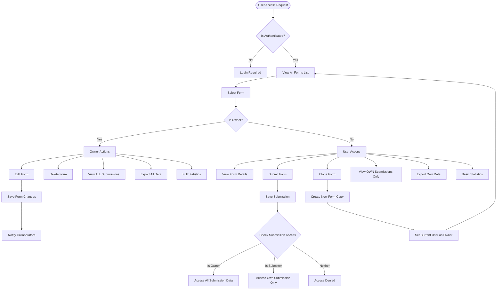

# 🔄 WORKFLOW & ROADMAP: Multi-User Access for Form Builder

## 📊 WORKFLOW DIAGRAM



## 🗺️ IMPLEMENTATION ROADMAP

### **PHASE 1: FOUNDATION (Week 1)**

#### Sprint 1.1: Backend Core Changes (Days 1-2)
```yaml
Day 1 - Morning:
  - Task: Modify FormService.ts
  - Changes:
    - Remove owner_id filters from getFormById()
    - Remove owner_id filters from listForms()
    - Keep owner checks for update/delete
  - Testing: Unit tests for new access patterns

Day 1 - Afternoon:
  - Task: Update SubmissionService.ts
  - Changes:
    - Implement conditional submission viewing
    - Add permission levels enum
    - Update listSubmissions() logic
  - Testing: Integration tests

Day 2 - Morning:
  - Task: Add Clone Feature Backend
  - Implementation:
    - New endpoint: POST /api/forms/:id/clone
    - Copy form structure without submissions
    - Set new owner_id
  - Testing: API tests

Day 2 - Afternoon:
  - Task: Statistics API
  - Implementation:
    - Public stats endpoint
    - Aggregate data without PII
    - Cache results for performance
  - Testing: Load testing
```

#### Sprint 1.2: Database & Security (Day 3)
```yaml
Day 3 - Morning:
  - Task: Database Optimization
  - Actions:
    - Add indexes for new query patterns
    - Create views for common queries
    - Optimize submission queries

Day 3 - Afternoon:
  - Task: Security Audit
  - Actions:
    - Review all permission checks
    - Add rate limiting for submissions
    - Implement CAPTCHA for public forms
    - Add audit logging
```

### **PHASE 2: FRONTEND IMPLEMENTATION (Week 1-2)**

#### Sprint 2.1: UI Components Update (Days 4-5)
```yaml
Day 4:
  - Task: Forms List Page
  - Changes:
    - Add "Created By" column
    - Add ownership badges
    - Update action buttons per role
    - Add filter: "All | My Forms | Others"
  
Day 5:
  - Task: Submissions Table View
  - Changes:
    - Implement conditional data display
    - Add ownership indicator
    - Update export options
    - Add info messages for limited access
```

#### Sprint 2.2: Form Builder Updates (Days 6-7)
```yaml
Day 6:
  - Task: Form Builder Readonly Mode
  - Implementation:
    - Detect non-owner access
    - Disable editing controls
    - Show ownership banner
    - Enable "Clone" button

Day 7:
  - Task: Clone Feature UI
  - Implementation:
    - Add clone button to form actions
    - Create clone confirmation dialog
    - Redirect to new form after clone
    - Show success notification
```

### **PHASE 3: TESTING & VALIDATION (Week 2)**

#### Sprint 3.1: Testing Suite (Days 8-9)
```yaml
Day 8 - E2E Testing:
  ✓ Owner can see all submissions
  ✓ Non-owner can only see own submissions
  ✓ All users can view all forms
  ✓ Only owner can edit/delete
  ✓ Clone feature works correctly
  ✓ Statistics show correctly per role

Day 9 - Performance Testing:
  ✓ Load test with 1000+ forms
  ✓ Submission load testing
  ✓ Concurrent user testing
  ✓ Database query optimization
```

#### Sprint 3.2: UAT & Bug Fixes (Days 10-11)
```yaml
Day 10:
  - User Acceptance Testing
  - Bug fixes from testing
  - Documentation updates

Day 11:
  - Final testing
  - Performance optimization
  - Prepare deployment
```

### **PHASE 4: DEPLOYMENT (Week 2 End)**

#### Sprint 4.1: Staged Rollout (Day 12)
```yaml
Morning:
  - Deploy to staging environment
  - Run smoke tests
  - Monitor performance

Afternoon:
  - Deploy to production (Blue-Green)
  - Monitor metrics
  - Ready rollback plan
```

## 📈 GANTT CHART

```
Task                    | Day 1 | Day 2 | Day 3 | Day 4 | Day 5 | Day 6 | Day 7 | Day 8 | Day 9 | Day 10 | Day 11 | Day 12
------------------------|-------|-------|-------|-------|-------|-------|-------|-------|-------|--------|--------|--------
Backend Core Changes    |  ███  |  ███  |       |       |       |       |       |       |       |        |        |
Database & Security     |       |       |  ███  |       |       |       |       |       |       |        |        |
Forms List UI          |       |       |       |  ███  |       |       |       |       |       |        |        |
Submissions View UI    |       |       |       |       |  ███  |       |       |       |       |        |        |
Form Builder Updates   |       |       |       |       |       |  ███  |       |       |       |        |        |
Clone Feature UI       |       |       |       |       |       |       |  ███  |       |       |        |        |
E2E Testing           |       |       |       |       |       |       |       |  ███  |       |        |        |
Performance Testing    |       |       |       |       |       |       |       |       |  ███  |        |        |
UAT & Bug Fixes       |       |       |       |       |       |       |       |       |       |  ███   |  ███   |
Deployment            |       |       |       |       |       |       |       |       |       |        |        |  ███
```

## ✅ ACCEPTANCE CRITERIA

### Backend Criteria
- [ ] All users can retrieve full forms list
- [ ] Forms list includes owner information
- [ ] Non-owners cannot edit/delete forms
- [ ] Clone endpoint creates independent copy
- [ ] Submissions filtered by ownership correctly
- [ ] Statistics API returns appropriate data per role
- [ ] API response time < 200ms for list operations
- [ ] Database queries optimized with proper indexes

### Frontend Criteria
- [ ] Forms list shows all forms with owner info
- [ ] Action buttons reflect user permissions
- [ ] Submissions table filters data correctly
- [ ] Form builder has readonly mode for non-owners
- [ ] Clone feature works with single click
- [ ] UI clearly indicates ownership status
- [ ] Loading states for all async operations
- [ ] Error messages are user-friendly

### Security Criteria
- [ ] No unauthorized data exposure
- [ ] Rate limiting prevents spam
- [ ] Audit logs capture all actions
- [ ] CAPTCHA for public form submissions
- [ ] Session management secure
- [ ] No SQL injection vulnerabilities

### Performance Criteria
- [ ] Page load time < 2 seconds
- [ ] API response time < 200ms
- [ ] Support 100+ concurrent users
- [ ] Database queries < 50ms
- [ ] Frontend bundle size < 500KB

## 🔄 ROLLBACK PLAN

### Rollback Triggers
1. **Critical Bug**: Data exposure or security breach
2. **Performance**: Response time > 5 seconds
3. **Data Loss**: Any submission data loss
4. **High Error Rate**: > 5% API errors

### Rollback Procedure
```bash
# 1. Switch load balancer to previous version
kubectl set image deployment/backend backend=backend:v1.0.0

# 2. Rollback database migrations
npm run migrate:rollback

# 3. Clear cache
redis-cli FLUSHALL

# 4. Restore frontend
kubectl set image deployment/frontend frontend=frontend:v1.0.0

# 5. Verify rollback
npm run health:check
```

### Rollback Timeline
- **Detection**: 0-5 minutes (automated monitoring)
- **Decision**: 5-10 minutes (team assessment)
- **Execution**: 10-15 minutes (rollback procedure)
- **Verification**: 15-20 minutes (health checks)
- **Total RTO**: < 30 minutes

## 📊 SUCCESS METRICS

### Week 1 Goals
- ✅ Backend changes complete
- ✅ 100% unit test coverage
- ✅ API documentation updated

### Week 2 Goals  
- ✅ Frontend implementation complete
- ✅ E2E tests passing
- ✅ UAT sign-off received

### Post-Launch Metrics (Week 3+)
- 📈 20% increase in form submissions
- 📈 30% increase in form sharing
- 📈 User satisfaction > 4.5/5
- 📈 Support tickets < 5 per day
- 📈 System uptime > 99.9%

## 🔔 MONITORING & ALERTS

### Key Metrics to Monitor
```yaml
Infrastructure:
  - CPU usage < 70%
  - Memory usage < 80%
  - Database connections < 100
  - API response time < 200ms

Business:
  - Forms created per hour
  - Submissions per hour
  - Clone operations per day
  - Error rate < 1%

Security:
  - Failed auth attempts
  - Rate limit violations
  - Unusual access patterns
  - Data export volumes
```

### Alert Thresholds
```yaml
Critical:
  - API error rate > 5%
  - Response time > 2s
  - Database connection pool exhausted
  - Security breach detected

Warning:
  - API error rate > 2%
  - Response time > 1s
  - CPU usage > 80%
  - Disk space < 20%

Info:
  - New user registrations
  - High submission volume
  - Successful deployments
```

## 📝 DOCUMENTATION UPDATES

### Required Documentation
1. **API Documentation**
   - New endpoints (clone, statistics)
   - Updated permissions model
   - Response format changes

2. **User Guide**
   - How to view shared forms
   - Understanding submission visibility
   - Using the clone feature

3. **Admin Guide**
   - Permission management
   - Monitoring guidelines
   - Troubleshooting guide

4. **Developer Documentation**
   - Architecture changes
   - Database schema updates
   - Testing procedures

## 🎯 RISK MITIGATION

### Identified Risks & Mitigations

| Risk | Probability | Impact | Mitigation |
|------|------------|---------|------------|
| Data exposure bug | Low | High | Extensive testing, security audit |
| Performance degradation | Medium | Medium | Load testing, caching, indexes |
| User confusion | Medium | Low | Clear UI indicators, documentation |
| Spam submissions | High | Low | Rate limiting, CAPTCHA |
| Database overload | Low | High | Connection pooling, query optimization |

## 🚀 LAUNCH CHECKLIST

### Pre-Launch (Day 11)
- [ ] All tests passing
- [ ] Documentation complete
- [ ] Rollback plan tested
- [ ] Monitoring configured
- [ ] Team briefed

### Launch Day (Day 12)
- [ ] Backup database
- [ ] Deploy backend
- [ ] Deploy frontend
- [ ] Smoke tests pass
- [ ] Monitor metrics

### Post-Launch (Day 13+)
- [ ] Monitor error rates
- [ ] Gather user feedback
- [ ] Address issues
- [ ] Plan next iteration
- [ ] Celebrate success! 🎉

---

**Status**: Ready for Implementation
**Next Step**: Begin Phase 1 - Backend Core Changes
**Estimated Completion**: 12 business days