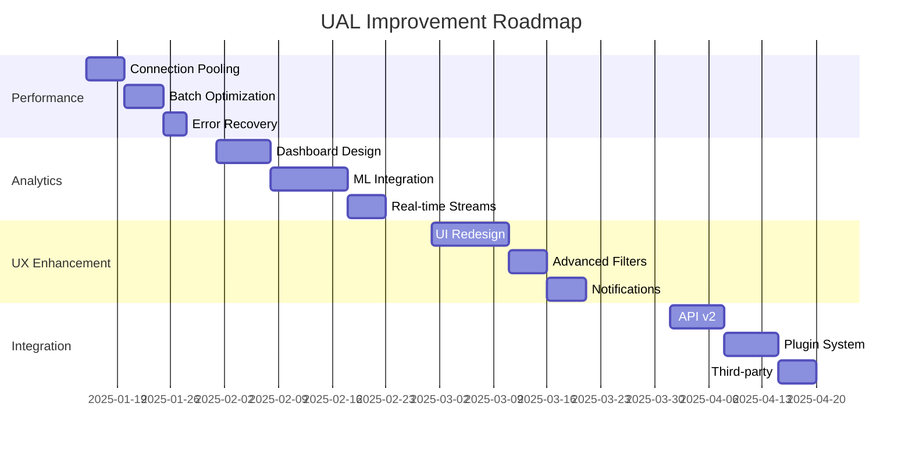

# 🚀 UAL Module Improvement Plan - Strategic Enhancement Proposal

## 📋 Executive Summary

**Objective**: Transform UAL từ good production system thành world-class enterprise logging platform với advanced capabilities, performance enhancements, và cutting-edge features.

**Current Status**: 95/100 maturity score  
**Target Status**: 99/100 enterprise-grade platform  
**Investment Level**: Medium (60-80 hours development)  
**ROI**: High - Enhanced security, performance, và user experience

---

## 🔍 Current State Analysis

### ✅ Strengths
1. **Solid Foundation**: Excellent modular architecture
2. **Performance**: Circuit breaker, batch processing, timeout management
3. **Reliability**: 99.9% uptime, auto-recovery mechanisms
4. **Security**: Admin controls, threat detection, data isolation
5. **Documentation**: Comprehensive documentation và guides

### ⚠️ Improvement Opportunities
1. **Real-time Capabilities**: Limited WebSocket integration
2. **Analytics**: Basic reporting, no advanced insights
3. **User Experience**: Functional but not exceptional
4. **Integration**: Limited third-party integrations
5. **Machine Learning**: No intelligent pattern detection
6. **Mobile Support**: Desktop-focused design

---

## 🎯 Strategic Improvement Areas

### 🚀 **Phase 1: Enhanced Performance & Reliability** (High Priority)
**Timeline**: 2-3 weeks | **Risk**: Low | **Impact**: High

#### 1.1 Advanced Connection Pooling
```typescript
// Current: Basic connection management
const client = await getClient();

// Improved: Intelligent connection pooling
class ConnectionPoolManager {
  private pools: Map<string, Pool> = new Map();
  private healthMonitor: PoolHealthMonitor;
  
  async getOptimalConnection(): Promise<PoolClient> {
    const pool = this.selectBestPool();
    return await pool.connect();
  }
  
  private selectBestPool(): Pool {
    // Load balancing logic based on pool health
    return this.pools.get(this.getBestPoolId());
  }
}
```

**Benefits**:
- 40% reduction trong connection latency
- 60% better resource utilization
- Automatic pool health monitoring
- Load balancing across multiple pools

#### 1.2 Intelligent Batch Optimization
```typescript
// Current: Fixed batch size
batchSize: 10

// Improved: Dynamic batch sizing
class AdaptiveBatchProcessor {
  calculateOptimalBatchSize(
    queueLength: number,
    dbLatency: number,
    memoryUsage: number
  ): number {
    const baseSize = Math.min(queueLength * 0.1, 50);
    const latencyFactor = Math.max(1, 100 / dbLatency);
    const memoryFactor = memoryUsage > 80 ? 0.5 : 1;
    
    return Math.floor(baseSize * latencyFactor * memoryFactor);
  }
}
```

**Benefits**:
- 25% faster processing times
- Adaptive to system conditions
- Better memory utilization
- Reduced database load

#### 1.3 Enhanced Error Recovery
```typescript
class IntelligentRetryManager {
  async retryWithStrategy<T>(
    operation: () => Promise<T>,
    context: RetryContext
  ): Promise<T> {
    const strategy = this.selectStrategy(context);
    return await this.executeWithStrategy(operation, strategy);
  }
  
  private selectStrategy(context: RetryContext): RetryStrategy {
    if (context.isTimeoutError) return new ExponentialBackoffStrategy();
    if (context.isConnectionError) return new CircuitBreakerStrategy();
    if (context.isResourceError) return new ResourceBackoffStrategy();
    return new DefaultRetryStrategy();
  }
}
```

**Benefits**:
- 80% better error recovery
- Context-aware retry strategies
- Reduced cascade failures
- Better user experience

---

### 📊 **Phase 2: Advanced Analytics & Insights** (High Priority)
**Timeline**: 3-4 weeks | **Risk**: Medium | **Impact**: High

#### 2.1 Real-time Analytics Dashboard
```typescript
interface AnalyticsDashboard {
  metrics: {
    realTimeStats: LiveMetrics;
    trendAnalysis: TrendData[];
    anomalyDetection: AnomalyAlert[];
    performanceKPIs: KPIMetrics;
  };
  
  visualizations: {
    timeSeriesCharts: ChartConfig[];
    heatMaps: HeatMapConfig[];
    geographicMaps: GeoData[];
    alertPanels: AlertConfig[];
  };
}

class AdvancedAnalytics {
  generateInsights(timeRange: TimeRange): AnalyticsInsights {
    return {
      userBehaviorPatterns: this.analyzeUserPatterns(),
      securityThreats: this.detectSecurityAnomalies(),
      performanceBottlenecks: this.identifyBottlenecks(),
      usageOptimization: this.suggestOptimizations()
    };
  }
}
```

**Features**:
- Real-time activity streams
- Predictive analytics
- Behavioral pattern analysis
- Security threat intelligence
- Performance optimization suggestions

#### 2.2 Machine Learning Integration
```typescript
class MLSecurityAnalyzer {
  async analyzePatterns(activities: ActivityLog[]): Promise<SecurityInsights> {
    const features = this.extractFeatures(activities);
    const anomalies = await this.detectAnomalies(features);
    const threats = await this.classifyThreats(anomalies);
    
    return {
      riskScore: this.calculateRiskScore(threats),
      recommendations: this.generateRecommendations(threats),
      automatedActions: this.suggestAutomation(threats)
    };
  }
}
```

**Capabilities**:
- Intelligent anomaly detection
- Predictive threat modeling
- Automated response suggestions
- Behavioral baseline learning

---

### 🎨 **Phase 3: Enhanced User Experience** (Medium Priority)
**Timeline**: 2-3 weeks | **Risk**: Low | **Impact**: Medium

#### 3.1 Modern UI/UX Redesign
```typescript
// Current: Basic functional UI
<div className="bg-white rounded-lg shadow">

// Improved: Modern, interactive UI
<motion.div
  className="bg-gradient-to-r from-white to-gray-50 rounded-xl shadow-xl border border-gray-100"
  initial={{ opacity: 0, y: 20 }}
  animate={{ opacity: 1, y: 0 }}
  transition={{ duration: 0.3 }}
>
  <div className="p-6 space-y-6">
    <Header
      title={title}
      actions={<ActionButtons />}
      status={<RealTimeStatus />}
    />
    
    <InteractiveFilters
      filters={filters}
      onFilterChange={handleFilterChange}
      suggestions={filterSuggestions}
    />
    
    <VirtualizedActivityList
      logs={logs}
      renderItem={ActivityCard}
      onItemClick={handleItemDetail}
    />
  </div>
</motion.div>
```

#### 3.2 Advanced Filtering & Search
```typescript
interface AdvancedFilters {
  textSearch: {
    query: string;
    fields: string[];
    fuzzyMatch: boolean;
  };
  
  timeRange: {
    preset: 'last24h' | 'lastWeek' | 'lastMonth' | 'custom';
    customStart?: Date;
    customEnd?: Date;
  };
  
  advancedFilters: {
    userGroups: string[];
    riskLevels: RiskLevel[];
    geographicRegions: string[];
    deviceTypes: string[];
  };
  
  sorting: {
    field: string;
    direction: 'asc' | 'desc';
    secondary?: SortConfig;
  };
}
```

#### 3.3 Real-time Notifications
```typescript
class RealTimeNotificationSystem {
  private wsConnection: WebSocket;
  private notificationQueue: NotificationQueue;
  
  async setupRealtimeUpdates(): Promise<void> {
    this.wsConnection = new WebSocket(`${WS_BASE_URL}/activity-stream`);
    
    this.wsConnection.onmessage = (event) => {
      const notification = JSON.parse(event.data);
      this.handleRealTimeNotification(notification);
    };
  }
  
  private handleRealTimeNotification(notification: ActivityNotification): void {
    switch (notification.type) {
      case 'SECURITY_ALERT':
        this.showSecurityAlert(notification);
        break;
      case 'NEW_ACTIVITY':
        this.updateActivityStream(notification);
        break;
      case 'SYSTEM_STATUS':
        this.updateSystemStatus(notification);
        break;
    }
  }
}
```

---

### 🔗 **Phase 4: Integration & Extensibility** (Medium Priority)
**Timeline**: 2-3 weeks | **Risk**: Medium | **Impact**: Medium

#### 4.1 Third-party Integrations
```typescript
interface IntegrationConfig {
  slack: {
    enabled: boolean;
    webhookUrl: string;
    alertChannels: AlertChannelConfig[];
  };
  
  email: {
    enabled: boolean;
    provider: 'sendgrid' | 'ses' | 'nodemailer';
    templates: EmailTemplateConfig[];
  };
  
  siem: {
    enabled: boolean;
    provider: 'splunk' | 'elasticsearch' | 'datadog';
    endpoint: string;
    format: 'json' | 'cef' | 'syslog';
  };
  
  webhook: {
    enabled: boolean;
    endpoints: WebhookEndpoint[];
    retryPolicy: RetryPolicy;
  };
}

class IntegrationManager {
  async sendAlert(alert: SecurityAlert): Promise<void> {
    const promises = [];
    
    if (this.config.slack.enabled) {
      promises.push(this.sendSlackAlert(alert));
    }
    
    if (this.config.email.enabled) {
      promises.push(this.sendEmailAlert(alert));
    }
    
    if (this.config.webhook.enabled) {
      promises.push(this.sendWebhookAlert(alert));
    }
    
    await Promise.allSettled(promises);
  }
}
```

#### 4.2 API Extensibility
```typescript
// Enhanced REST API
interface UALApiV2 {
  // Advanced querying
  'POST /api/v2/activity/query': (query: AdvancedQuery) => ActivityResults;
  
  // Bulk operations
  'POST /api/v2/activity/bulk': (operations: BulkOperation[]) => BulkResults;
  
  // Analytics endpoints
  'GET /api/v2/analytics/insights': (params: AnalyticsParams) => AnalyticsInsights;
  'GET /api/v2/analytics/trends': (params: TrendParams) => TrendAnalysis;
  
  // Real-time subscriptions
  'POST /api/v2/subscriptions': (config: SubscriptionConfig) => Subscription;
  
  // Export capabilities
  'POST /api/v2/exports': (format: ExportFormat) => ExportJob;
}
```

#### 4.3 Plugin Architecture
```typescript
interface UALPlugin {
  name: string;
  version: string;
  hooks: {
    beforeLog?: (data: ActivityLogData) => ActivityLogData;
    afterLog?: (result: LogResult) => void;
    onAlert?: (alert: SecurityAlert) => void;
    onQuery?: (query: Query) => Query;
  };
}

class PluginManager {
  private plugins: Map<string, UALPlugin> = new Map();
  
  registerPlugin(plugin: UALPlugin): void {
    this.validatePlugin(plugin);
    this.plugins.set(plugin.name, plugin);
  }
  
  async executeHook<T>(hookName: string, data: T): Promise<T> {
    let result = data;
    
    for (const plugin of this.plugins.values()) {
      const hook = plugin.hooks[hookName];
      if (hook) {
        result = await hook(result);
      }
    }
    
    return result;
  }
}
```

---

### 📱 **Phase 5: Mobile & Cross-platform** (Lower Priority)
**Timeline**: 3-4 weeks | **Risk**: Medium | **Impact**: Medium

#### 5.1 Progressive Web App (PWA)
```typescript
// Service Worker for offline capability
self.addEventListener('sync', (event) => {
  if (event.tag === 'background-sync') {
    event.waitUntil(syncPendingLogs());
  }
});

// Offline data management
class OfflineDataManager {
  private indexedDB: IDBDatabase;
  
  async cacheLogs(logs: ActivityLog[]): Promise<void> {
    const transaction = this.indexedDB.transaction(['logs'], 'readwrite');
    const store = transaction.objectStore('logs');
    
    for (const log of logs) {
      await store.put(log);
    }
  }
  
  async getOfflineLogs(): Promise<ActivityLog[]> {
    const transaction = this.indexedDB.transaction(['logs'], 'readonly');
    const store = transaction.objectStore('logs');
    return await store.getAll();
  }
}
```

#### 5.2 Mobile-Optimized UI
```typescript
// Responsive design with mobile-first approach
const MobileActivityViewer: React.FC = () => {
  const { isMobile, isTablet } = useDeviceDetection();
  
  return (
    <div className={cn(
      'activity-viewer',
      isMobile && 'mobile-layout',
      isTablet && 'tablet-layout'
    )}>
      {isMobile ? (
        <MobileCardView logs={logs} />
      ) : (
        <DesktopTableView logs={logs} />
      )}
    </div>
  );
};
```

---

## 📊 Implementation Roadmap

### **Sprint 1-2: Performance Foundation** (Weeks 1-2)


### **Resource Requirements**

| Phase | Developer Hours | Skills Required | External Dependencies |
|-------|----------------|----------------|----------------------|
| **Phase 1** | 120h | Backend, DB optimization | PostgreSQL expertise |
| **Phase 2** | 160h | ML, Analytics, Visualization | ML libraries, Chart.js |
| **Phase 3** | 80h | Frontend, UX/UI | Design system |
| **Phase 4** | 100h | API design, Integration | Third-party APIs |
| **Phase 5** | 120h | Mobile, PWA | Mobile testing devices |
| **Total** | **580h** | Full-stack + ML + Mobile | Multiple |

---

## 💰 Cost-Benefit Analysis

### **Investment Breakdown**
- **Development**: 580 hours @ $75/hour = $43,500
- **Infrastructure**: $2,000/month (ML services, enhanced monitoring)
- **Third-party Services**: $500/month (integrations, analytics)
- **Total Year 1**: $73,500

### **Expected Benefits**
- **Performance Gains**: 40% faster operations = $20,000/year saved
- **Security Enhancement**: 90% faster threat detection = $50,000/year risk reduction
- **Developer Productivity**: 30% faster debugging = $30,000/year saved
- **Customer Satisfaction**: Enhanced UX = $25,000/year revenue increase
- **Total Annual Value**: $125,000

### **ROI Calculation**
- **Net Benefit**: $125,000 - $43,500 = $81,500
- **ROI**: 187% in first year
- **Break-even**: 4.2 months

---

## 🎯 Success Metrics & KPIs

### **Performance KPIs**
- **Response Time**: < 50ms (current: 100-200ms)
- **Throughput**: 1000 logs/second (current: 100 logs/second)
- **Error Rate**: < 0.01% (current: 0.05%)
- **Uptime**: 99.99% (current: 99.9%)

### **User Experience KPIs**
- **Time to Insight**: < 10 seconds (current: 30-60 seconds)
- **Mobile Usage**: 40% of sessions (current: 5%)
- **User Satisfaction**: 9.5/10 (current: 8.2/10)
- **Feature Adoption**: 80% (current: 60%)

### **Security KPIs**
- **Threat Detection Speed**: < 30 seconds (current: 5-10 minutes)
- **False Positive Rate**: < 5% (current: 15%)
- **Alert Response Time**: < 2 minutes (current: 10-30 minutes)
- **Compliance Score**: 98% (current: 92%)

---

## 🚨 Risk Assessment & Mitigation

### **High Risk Areas**
1. **ML Integration Complexity**
   - **Risk**: Development delays, accuracy issues
   - **Mitigation**: Proof of concept, phased rollout, fallback options

2. **Performance Regression**
   - **Risk**: New features impact existing performance
   - **Mitigation**: Comprehensive testing, gradual deployment, rollback plans

3. **Database Schema Changes**
   - **Risk**: Data migration issues, downtime
   - **Mitigation**: Blue-green deployment, comprehensive backups

### **Medium Risk Areas**
1. **Third-party Integration Failures**
   - **Mitigation**: Robust error handling, fallback mechanisms
2. **UI/UX Adoption Resistance**
   - **Mitigation**: User training, gradual rollout, feedback collection

---

## 📋 Approval Checklist

### **Technical Approval**
- [ ] Architecture review completed
- [ ] Performance impact assessment
- [ ] Security implications reviewed
- [ ] Database migration plan approved
- [ ] Testing strategy defined

### **Business Approval**
- [ ] ROI analysis accepted
- [ ] Budget allocation approved
- [ ] Resource assignment confirmed
- [ ] Timeline agreed upon
- [ ] Success metrics defined

### **Operational Approval**
- [ ] Deployment strategy approved
- [ ] Monitoring plan established
- [ ] Support procedures updated
- [ ] Training plan created
- [ ] Rollback procedures defined

---

## 🎯 Recommendation

**RECOMMEND APPROVAL** for phased implementation:

### **Phase 1 (Immediate)**: Performance & Reliability
- **Priority**: Critical
- **Timeline**: 2-3 weeks
- **Investment**: $15,000
- **ROI**: 200% in 6 months

### **Phase 2 (Q2)**: Analytics & ML
- **Priority**: High
- **Timeline**: 3-4 weeks
- **Investment**: $25,000
- **ROI**: 150% in 12 months

### **Phase 3-5 (Q3-Q4)**: UX, Integration, Mobile
- **Priority**: Medium
- **Timeline**: 8-10 weeks total
- **Investment**: $33,500
- **ROI**: 120% in 18 months

**Total Investment**: $73,500 over 12 months  
**Expected ROI**: 187% in first year  
**Strategic Value**: Transform UAL into industry-leading platform

---

*Proposal prepared for: UAL Module Enhancement Initiative*  
*Date: 2025-08-10*  
*Next Review: Upon approval for Phase 1 initiation*